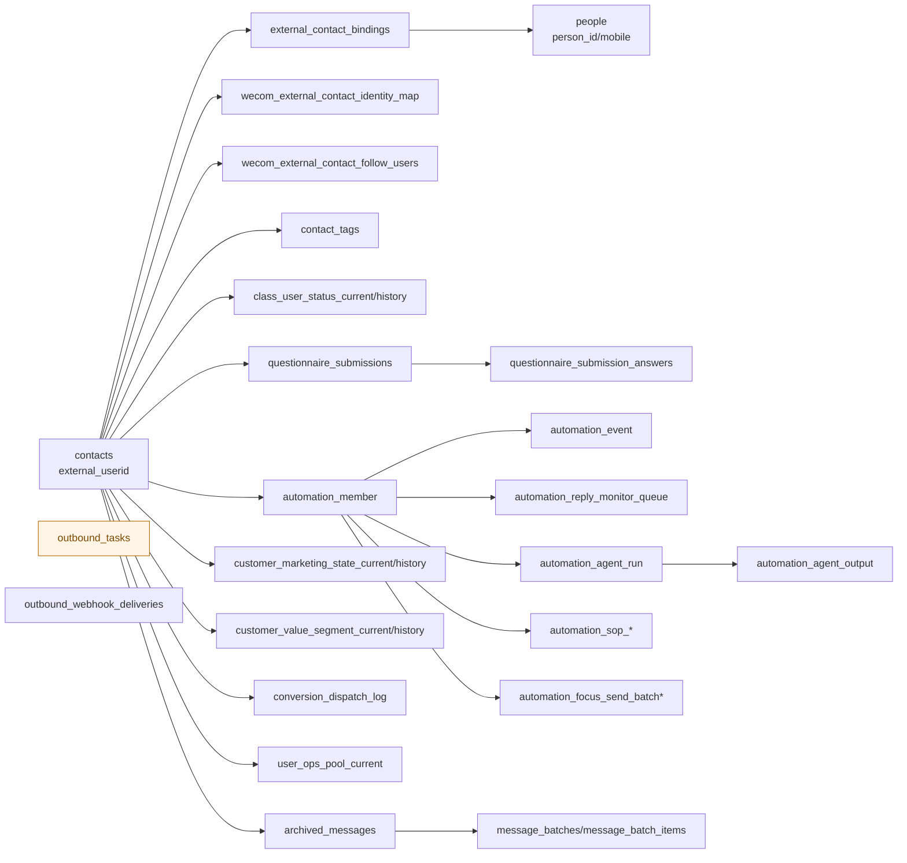

# AI Customer Pulse 当前仓库审计

审计时间：2026-04-11
审计方式：只读代码、现有文档、测试、schema、路由清单；未进入正式开发。

> 更新说明（2026-04-11）
> 本文是 Customer Pulse 正式开发前的基线审计，缺口清单反映的是当时仓库状态。
> 其后续落地情况以 [02-design.md](/Users/qianlan/Downloads/aicrm-new-codex-1/docs/ai-customer-pulse/02-design.md)、[03-rollout.md](/Users/qianlan/Downloads/aicrm-new-codex-1/docs/ai-customer-pulse/03-rollout.md) 和 [99-acceptance-report.md](/Users/qianlan/Downloads/aicrm-new-codex-1/docs/ai-customer-pulse/99-acceptance-report.md) 为准。

## 一句话结论

这个仓库已经具备一套可落地的 SCRM 基础设施：客户中心、时间线、问卷、标签、消息归档、侧边栏操作、用户运营批量发送、自动化转化、SOP、AI Agent 编排、MCP、审计和定时 runner 都已经存在。

但它还没有“统一 AI 客户推进收件箱”这个产品层抽象。当前最接近收件箱的能力分散在 4 处：

- `/admin` 工作台背后的 `todos`（`/api/admin/dashboard/todos`）
- `/admin/jobs` 的待处理队列
- `/admin/automation-conversion/runtime?tab=reply-monitor`
- `/admin/customers/<external_userid>` 上的单客户 `AI Customer Pulse`

如果要做“AI 客户推进收件箱”，最佳切入点不是从零新造消息系统，而是复用现有客户聚合读模型、自动化转化队列、预览后执行发送链路和 `ai_customer_pulse` feature flag，把它们收口成新的读模型和操作面板。

## 1. 页面地图

| 页面 | 路径 | 当前已完成内容 | 背后能力 | 与 Pulse 的关系 |
| --- | --- | --- | --- | --- |
| 工作台 | `/admin` | 系统概况、业务总览、待处理事项、快捷入口 | `domains.admin_dashboard` + `domains.admin_jobs` | 现有“待办聚合”入口，可扩成跨模块提醒 |
| 客户列表 | `/admin/customers` | 按关键词/负责人/手机号查客户 | `customer_center.service.list_customers` | 可做 Pulse 列表筛选，但目前没有待办视图 |
| 客户详情 | `/admin/customers/<external_userid>` | 客户档案、实时标签、问卷答案、聊天记录、自动化转化侧栏 | `domains.admin_console.customer_profile_service` | 已有 `AI Customer Pulse` 卡位，且已挂 `ai_customer_pulse` flag |
| 用户运营页 | `/admin/user-ops/ui` | 运营池筛选、全选、免打扰、批量私信预览/执行、发送记录 | `domains.user_ops.page_service` | 可复用“先预览再执行”的发送链路 |
| 自动化转化概览 | `/admin/automation-conversion` | 经营驾驶舱、阶段看板、消息活跃同步、自动接话监控 | `domains.automation_conversion.service` | 最接近“收件箱运营面板” |
| 自动化转化成员运营 | `/admin/automation-conversion/programs/<program_id>/member-ops` | 按阶段看成员、做池子操作 | `automation_member` 读模型 | 可作为候选客户列表承载页 |
| 自动化转化 Run Center | `/admin/automation-conversion/runtime` | sync、reply-monitor、model-infra、agent-orchestration、logs、debug | AI、SOP、队列、日志都在这里 | 最强接入点 |
| SOP 管理 | `/admin/automation-conversion/programs/<program_id>/flow-design?section=sop` | 池子 SOP 配置、模板、batch 摘要 | `automation_sop_*` | 可复用模板与批次执行模型，但不是收件箱 |
| 问卷控制台 | `/admin/questionnaires`、`/admin/questionnaires/<id>` | 问卷建模、打分、外推日志、调试 | `domains.questionnaire` | 提供客户意图证据源 |
| 同步任务页 | `/admin/jobs` | archive sync、callbacks、message batches、deferred jobs、webhooks | `domains.admin_jobs` | 提供“队列/失败/重试”式 inbox 基础体验 |
| 配置中心 | `/admin/config/*` | app settings、routing、signup tags、MCP tools | `domains.admin_config` | feature flag 与 AI / webhook 配置入口 |
| MCP 页面 | `/admin/mcp` | MCP preflight、sample-call、工具开关 | `mcp_adapter` + `domains.admin_config` | AI 工具治理入口 |
| 审计页 | `/admin/audit` | 后台关键操作与配置变更日志 | `domains.admin_audit` | 复用治理与追责 |
| 企微侧边栏 | `/sidebar/bind-mobile` 及 `/api/sidebar/*` | 绑定手机号、改跟进段、确认成交、报名标签状态 | `http.sidebar` | 单客户轻操作入口，适合嵌入 Pulse 快捷动作 |

## 2. 核心实体关系

### 实体要点

| 实体 | 当前作用 | 备注 |
| --- | --- | --- |
| `contacts` | 客户快照主表 | `external_userid` 是详情与时间线主键 |
| `people` + `external_contact_bindings` | 手机号绑定与人实体 | 让企微客户和手机号身份收口 |
| `wecom_external_contact_identity_map` | unionid/openid/external_userid 映射 | 问卷 OAuth 和 CRM 解析依赖它 |
| `wecom_external_contact_follow_users` | 跟进人快照 | 客户 owner/follow_users 的补充来源 |
| `contact_tags` | 本地标签快照 | 实时标签另外通过 WeCom API 拉取 |
| `class_user_status_current/history` | 报名状态与状态历史 | 时间线事件源之一 |
| `questionnaires/*` | 问卷定义、提交、答案、外推日志 | 当前最强“意图证据源” |
| `archived_messages` | 聊天归档主表 | timeline、recent messages、message batching 共用 |
| `message_batches/message_batch_items` | 消息窗口批次 | 更像消息处理批次，不是客户推进 inbox |
| `user_ops_pool_current` | 运营名单池 | `/admin/user-ops/ui` 的基础池 |
| `customer_marketing_state_*` | 客户营销阶段 current/history | 自动化转化主状态机 |
| `customer_value_segment_*` | 客户价值分层 current/history | top/core/normal 等证据 |
| `conversion_dispatch_log` | OpenClaw 派发记录 | timeline 已接入 |
| `automation_member` | 自动化转化成员主表 | 阶段名单、SOP、reply monitor 都围绕它 |
| `automation_reply_monitor_queue` | 自动接话待处理队列 | 最接近“AI 待办 inbox” 的现有实体 |
| `automation_agent_run/output` | AI run 和输出 ledger | 已记录置信度、reason、draft 输出 |
| `automation_sop_*` | 自动 SOP 配置、进度、批次 | 只覆盖部分池子 |
| `automation_focus_send_batch*` | 重点跟进批处理批次 | AI 批量处理执行记录 |
| `outbound_tasks` | 对外发送任务实际落库 | 当前没有可靠 `external_userid` 独立列 |
| `outbound_webhook_deliveries` | 外发 webhook 投递与重试 | jobs 和治理入口已接入 |

## 3. 核心 API

### 3.1 客户 / 时间线 / 消息

| API | 当前语义 | 备注 |
| --- | --- | --- |
| `GET /api/customers` | 客户列表聚合接口 | OpenClaw 读契约已固化 |
| `GET /api/customers/<external_userid>` | 客户详情聚合接口 | 已可附带 `customer_pulse` |
| `GET /api/customers/<external_userid>/timeline` | 客户时间线聚合接口 | 已聚合消息、状态变更、问卷、企微事件、营销状态、分层、OpenClaw 派发 |
| `GET /api/messages/<external_userid>/recent` | 最近聊天上下文 | OpenClaw chat context 依赖 |
| `GET /api/admin/customers/profile` | admin 客户 profile 聚合 | 支持 `external_userid/mobile/user_id` 解析 |
| `GET /api/admin/customers/profile/pulse` | 单客户 Pulse 数据 | 已挂载 `ai_customer_pulse` |

### 3.2 侧边栏 / 标签 / 任务

| API | 当前语义 | 备注 |
| --- | --- | --- |
| `GET /api/sidebar/contact-binding-status` | 绑定状态 | 单客户动作前置 |
| `GET /api/sidebar/marketing-status` | 自动化营销状态预览 | 可读当前池子、阶段、问卷状态 |
| `POST /api/sidebar/marketing-status/set-followup-segment` | 人工改判普通/重点 | 已是现成的人工作用点 |
| `POST /api/sidebar/marketing-status/mark-enrolled` | 人工确认成交 | 退出营销动作 |
| `POST /api/sidebar/marketing-status/unmark-enrolled` | 撤销成交 | 恢复营销 |
| `POST /api/tags/mark` / `/unmark` | 给客户打/移标签 | 直接调用 WeCom 能力 |
| `POST /api/tasks/private-message` | 直接创建私信任务 | 这是“立即创建任务”，不是草稿链路 |

### 3.3 用户运营 / 自动化转化

| API | 当前语义 | 备注 |
| --- | --- | --- |
| `POST /api/admin/user-ops/batch-send/preview` | 预览批量发送名单与跳过原因 | 现成的“先预览再执行” |
| `POST /api/admin/user-ops/batch-send/execute` | 确认后执行批量发送 | 可复用到 Pulse 批量动作 |
| `GET /api/admin/user-ops/send-records` | 页面级发送记录 | 页面内审计 |
| `GET /api/admin/automation-conversion/member` | 单客户自动化成员视图 | 客户详情页侧栏在用 |
| `POST /api/admin/automation-conversion/member/*` | 放入池/移出池/设 focus/设 normal/mark won | 单客户推进动作已经存在 |
| `GET /api/admin/automation-conversion/agent-outputs` | AI 输出列表 | 可做收件箱输入源 |
| `GET /api/admin/automation-conversion/agent-outputs/<output_id>` | 单输出详情 | 可溯源 reason/confidence |
| `POST /api/admin/automation-conversion/stage/<stage_key>/manual-send/preview` | 阶段群发预览 | 已有草稿前置 |
| `POST /api/admin/automation-conversion/stage/<stage_key>/manual-send` | 阶段群发执行 | 已有执行链路 |
| `POST /admin/automation-conversion/programs/<program_id>/member-ops/stage/<stage_key>/send` | 后台 member-ops no-JS 表单兜底发送 | 浏览器 session + admin action token + multipart 图片上传；旧 `/admin/automation-conversion/stage/<stage_key>/send` 已下线 |
| `POST /api/admin/automation-conversion/reply-monitor/run-due` | 自动接话队列放行 | internal-token 调用；浏览器页面入口为 `/admin/automation-conversion/auto-reply/reply-monitor/run-due` |
| `POST /api/admin/automation-conversion/sop/run-due` | 自动 SOP runner | 既可手动，也可 cron 调度 |

### 3.4 配置 / 治理 / 内部调用

| API | 当前语义 | 备注 |
| --- | --- | --- |
| `GET/POST /api/admin/config/app-settings` | 应用配置中心 | feature flag 当前就走这里 |
| `POST /api/customers/automation/activation-webhook` | 外部激活回写 | 自动化状态入口 |
| `/mcp` | MCP adapter | OpenClaw/MCP 工具统一入口 |
| `GET /api/admin/audit/logs` | 后台操作审计 | 新功能应复用 |

## 4. 事件流

### 4.1 客户与消息流

1. 企微联系人与群聊经 `contacts`、`group_chats`、callback、sync job 落本地表。
2. 聊天归档写入 `archived_messages`。
3. 归档消息再被物化成 `message_batches/message_batch_items`。
4. `customer_center`、`customer_timeline`、OpenClaw chat context 都从这些只读聚合层取数。

### 4.2 问卷与营销状态流

1. H5 问卷页经微信 OAuth 把 `openid/unionid/respondent_key` 写入 Flask session。
2. 问卷提交写 `questionnaire_submissions` 和 `questionnaire_submission_answers`。
3. `marketing_automation.service` 根据问卷、试用开通、激活回写、人工改判，计算 `customer_marketing_state_*` 与 `customer_value_segment_*`。
4. 客户详情页、侧边栏、自动化转化页都读这两个 current/history 视图。

### 4.3 自动接话与 AI 输出流

1. 自动接话监控扫描自动化范围客户的新私聊消息。
2. 命中后写 `automation_reply_monitor_queue`。
3. run-due 消费队列，触发 OpenClaw webhook 或 agent orchestration。
4. Agent run 写 `automation_agent_run`，输出写 `automation_agent_output`。
5. 当前 `customer_pulse` 会从 `automation_agent_output` 中挑高置信输出，并从 run input + timeline + marketing state 反推证据。

### 4.4 人工发送流

1. 用户运营页、阶段群发页先做 preview。
2. 确认后才调用现有 WeCom 发送链路，写 `outbound_tasks` / 页面级 send record / batch。
3. webhook 外发另走 `outbound_webhook_deliveries` 重试链路。

## 5. 当前已完成功能清单

### 5.1 按页面

| 页面 | 已完成内容 |
| --- | --- |
| `/admin` | 系统状态、业务总览、待处理事项、模块跳转 |
| `/admin/customers` | 客户搜索列表 |
| `/admin/customers/<external_userid>` | 客户基本资料、实时标签、问卷答案、聊天记录、自动化转化侧栏、可选 Pulse 卡位 |
| `/admin/user-ops/ui` | 运营池筛选、免打扰、批量私信预览/执行、发送记录 |
| `/admin/automation-conversion` | 自动化经营概览、消息活跃同步、自动接话监控、阶段看板 |
| `/admin/automation-conversion/runtime` | sync、reply-monitor、model-infra、agent-orchestration、replay、outputs、logs、debug |
| `/admin/automation-conversion/programs/<program_id>/flow-design?section=sop` | SOP 配置、模板、recent batch |
| `/admin/questionnaires` | 问卷创建、编辑、导出、debug、外推日志 |
| `/admin/jobs` | 同步任务、回调、消息批次、deferred job、webhook 投递 |
| `/admin/config/*` | app settings、路由、标签规则、MCP 工具配置 |
| `/admin/audit` | 后台关键动作审计 |
| `/sidebar/*` | 手机号绑定、报名状态、营销状态、人工改判、人工确认成交 |

### 5.2 按实体

| 领域 | 当前已落地实体 |
| --- | --- |
| 客户 | `contacts`、`people`、`external_contact_bindings`、`wecom_external_contact_identity_map`、`wecom_external_contact_follow_users` |
| 会话/消息 | `archived_messages`、`message_batches`、`message_batch_items`、`group_chats` |
| 标签 | `contact_tags`、`signup_tag_rules` |
| 运营 | `user_ops_pool_current/history`、`user_ops_do_not_disturb`、`user_ops_send_records` |
| 问卷 | `questionnaires`、`questionnaire_questions/options/score_rules`、`questionnaire_submissions`、`questionnaire_submission_answers` |
| 自动化转化 | `customer_marketing_state_*`、`customer_value_segment_*`、`conversion_dispatch_log`、`automation_member/channel/event` |
| AI | `automation_agent_prompt_registry`、`automation_agent_config`、`automation_agent_run`、`automation_agent_output`、`automation_agent_llm_call_log`、`automation_agent_skill_call_audit` |
| SOP / 批次 | `automation_sop_*`、`automation_focus_send_batch*`、`automation_reply_monitor_queue` |
| 外发 | `outbound_tasks`、`outbound_webhook_deliveries` |
| 治理 | `app_settings`、`admin_operation_logs`、`mcp_tool_settings` |

### 5.3 按接口

| 接口层 | 已完成内容 |
| --- | --- |
| CRM 聚合读 | customers list/detail、timeline、recent messages、admin customer profile |
| 标签/任务 | tags mark/unmark、private-message/moment/group-message task |
| 自动化转化 | member state、池子动作、agent outputs、SOP config/batches、reply monitor、model infra |
| 用户运营 | overview/list/export、DND、batch send preview/execute、send records |
| 问卷 | public H5、submit、OAuth、admin CRUD、external push logs |
| jobs | sync、callback、message batch、deferred、webhook retry |
| MCP | resolve_customer、get_customer_context、messages、batches、agent config draft 等 |

### 5.4 按服务层

| 服务层 | 已完成内容 |
| --- | --- |
| `customer_center.service` | 多表聚合客户列表/详情 |
| `customer_timeline.service` | 聚合消息、状态、问卷、企微事件、营销状态、分层、OpenClaw 派发 |
| `domains.user_ops.page_service` | 运营名单查询、DND、发送预览/执行、记录 |
| `domains.marketing_automation.service` | 营销状态计算、分池、人工确认成交、外部回写 |
| `domains.automation_conversion.service` | 自动化转化页面与配置主逻辑 |
| `domains.automation_conversion.orchestration_service` | reply-monitor、队列、AI 编排执行 |
| `domains.tasks.service` | WeCom task dispatch 与 conversion feedback |
| `domains.tags.service` | 标签快照、WeCom tag 操作、报名状态规则 |
| `domains.admin_dashboard/admin_jobs/admin_audit` | 工作台、同步任务、审计读模型 |

## 6. 缺口清单

### 6.1 按页面

| 页面缺口 | 现状 |
| --- | --- |
| 统一“AI 客户推进收件箱”页面 | 不存在 |
| 客户列表上的 Pulse / 待办筛选 | 不存在 |
| 面向运营的“待确认草稿箱” | 不存在，只有 preview 弹层/执行前置 |
| 单独的商机/推进 pipeline 页面 | 未发现 |
| 独立知识库 / 话术库页面 | 未发现，只有 SOP 模板和 agent prompt |

### 6.2 按实体

| 实体缺口 | 现状 |
| --- | --- |
| `customer_pulse_inbox` 或等价队列表 | 不存在 |
| 商机 / deal / opportunity 实体 | 未发现 |
| 可人工处理的“草稿消息”持久化实体 | 没有统一实体；`automation_agent_output` 可存 AI draft，但不是发送草稿箱 |
| AI 证据统一 ledger | 不存在；证据目前在 Pulse 内按 timeline/run input 动态拼接 |
| 独立知识库 / 话术素材库 | 不存在；仅有 `automation_sop_template` 与 prompt registry |

### 6.3 按接口

| 接口缺口 | 现状 |
| --- | --- |
| `GET /api/admin/customer-pulse/inbox` 一类聚合列表接口 | 不存在 |
| “生成草稿但不发送”的统一 API | 不存在；不同页面各有 preview/execute |
| “接受/拒绝/标记稍后处理”一类收件箱动作 API | 不存在 |
| 统一 evidence schema API | 不存在；Pulse 仅在单客户接口里返回 evidence |
| 基于 `external_userid` 的发送任务 timeline 事件 | 当前 `outbound_tasks` 可靠关联不足，timeline 未接入 |

### 6.4 按服务层

| 服务缺口 | 现状 |
| --- | --- |
| 统一 Pulse 读模型聚合服务 | 只有 `customer_center.pulse_service`，范围是单客户 |
| 统一收件箱排序/去重/状态流转服务 | 不存在 |
| AI 输出证据标准化 | 目前 `automation_agent_output` 记录 confidence/reason，但证据不是统一字段 |
| 跨 owner / 跨模块的操作权限策略 | 未发现成熟 RBAC；主要靠 token、session action token、owner 语义 |
| OpenClaw 会话 runtime / session runtime | `openclaw_service` 仅有 CLI/tool/service，没有真实 conversation runtime |

## 7. 权限点

- 内部接口保护：`http.internal_auth.require_internal_api_token()`，核心依赖 `AUTOMATION_INTERNAL_API_TOKEN`，MCP 额外可校验 `MCP_BEARER_TOKEN`。
- 后台写操作保护：`ensure_admin_console_action_token()` / `validate_admin_console_action_token()`，相当于 admin 写操作的 action token。
- MCP 工具级权限：`mcp_adapter.py` 已有 `permission_scope`，至少出现 `read`、`draft_write`、`export`、`suggest_only`。
- 配置治理：`app_settings`、`mcp_tool_settings`、`admin_operation_logs` 已构成最小治理闭环。
- AI 调用审计：`automation_agent_llm_call_log`、`automation_agent_skill_call_audit` 已存在。
- 缺口：没有明确发现一套细粒度后台角色权限或按 owner 的强 RBAC 守卫。

## 8. 可复用点

### 8.1 timeline / activity

- `customer_timeline.service` 已经把消息、问卷、企微事件、营销状态、分层、OpenClaw 派发收成统一事件流。
- `GET /api/customers/<external_userid>/timeline` 已经是稳定契约。
- 这非常适合做 Pulse 证据源和“为什么推荐这一步”的展示层。

### 8.2 inbox

- 没有统一 inbox，但已有 4 类可复用“待处理列表”：
  - `admin_dashboard.build_dashboard_todos()`
  - `admin_jobs` 的 pending batches / deferred jobs / failed callbacks / failed sync
  - `automation_reply_monitor_queue`
  - `automation_focus_send_batch` / `automation_sop_batch`
- 结论：应该复用这些队列式读模型风格，而不是新造完全不同的操作台。

### 8.3 侧边栏

- `/api/sidebar/marketing-status*` 已覆盖人工改判、确认成交、撤销成交。
- `/api/sidebar/contact-binding-status`、`/api/sidebar/signup-tags/status` 已是单客户即点即用能力。
- 如果 Pulse 需要“快速把客户推进到下一状态”，侧边栏动作可直接复用。

### 8.4 草稿发送

- `/api/admin/user-ops/batch-send/preview` + `/execute` 已是明确的“先预览再执行”。
- `/api/admin/automation-conversion/stage/<stage_key>/manual-send/preview` + `/manual-send` 也是同样模式。
- `customer_detail` 里的 tag/task action 也是 preview 后 confirm。
- 风险点：底层 `/api/tasks/*` 是立即创建任务，不应直接暴露给 Pulse。

### 8.5 AI 摘要 / 推荐

- `automation_agent_output` 已有 `output_type`、`confidence`、`reason`、`need_human_review`、`draft_reply` 等字段。
- `customer_center.pulse_service` 已用 `ai_customer_pulse` flag 做了单客户版：
  - 高置信时展示 AI 建议/草稿
  - 低置信时降级为规则建议
  - 必须带 `evidence`
- 这说明产品约束已经有一版实现方式，但还没扩展成列表级 inbox。

### 8.6 权限校验

- admin action token、internal token、MCP scope、audit log 都可复用。
- 新功能不需要自造权限系统，但需要补 owner 视角和列表级治理策略。

### 8.7 feature flag

- 仓库没有专门 feature flag 平台，现有模式是 `app_settings` + `current_app.config` + `infra.settings.get_setting()`。
- `ai_customer_pulse` 已被单客户 Pulse 读取并在前端 `customer_profile.js` 生效。
- 新能力最稳妥的做法是沿用这个模式，而不是引入新 flag 机制。

## 9. 风险

- 数据分散：客户推进相关事实分散在 `timeline`、`marketing_state`、`reply_monitor_queue`、`agent_output`、`outbound_tasks`、`webhook deliveries`。
- 证据标准不统一：当前只有单客户 Pulse 把证据做成一等输出，Agent 输出本身没有统一 evidence schema。
- 草稿和发送分离不统一：有的页面有 preview/execute，有的底层 API 是直接 dispatch。
- 权限模型偏轻：目前更像“后台操作令牌 + 审计”，不是严格 RBAC。
- `outbound_tasks` 缺可靠 `external_userid`：导致 timeline 难以完整反映发送动作。
- OpenClaw 没有真实会话 runtime：如果想做深度对话式收件箱，仓库还没这个运行时入口。
- `ai_customer_pulse` 目前是单客户展示位：如果直接硬扩成列表页，容易把客户详情逻辑和列表读模型耦死。

## 10. 三个最合理的接入点

### 接入点 1：客户详情页 `AI Customer Pulse`

位置：

- `/admin/customers/<external_userid>`
- `domains.admin_console.customer_profile_service`
- `customer_center.pulse_service`

优点：

- 现成 flag、现成 UI 卡位、现成 evidence 展示。
- 风险最低，最贴近单客户“辅助推进”。

限制：

- 不是收件箱，只能单客查看。
- 无法做运营级批量处理与排序。

### 接入点 2：自动化转化 Run Center 新增 `customer-pulse` 子页

位置：

- `/admin/automation-conversion/runtime`
- `domains.automation_conversion.service`
- `automation_reply_monitor_queue`、`automation_agent_output`、`automation_member`

优点：

- 现有 AI、队列、SOP、日志、reply monitor 都在这里。
- 天然适合做“待处理客户推进项”。
- 可直接复用 run center 的治理、操作 token、日志视图。

限制：

- 初期更偏运营后台，不是全站统一入口。
- 需要额外定义收件箱排序、去重、状态流转。

### 接入点 3：工作台 `/admin` 新增 Pulse todo group

位置：

- `domains.admin_dashboard.service.build_dashboard_todos`

优点：

- 最轻量，能先把“需要处理的客户推进项”抛到首页。
- 适合作为总入口和导航分发。

限制：

- 只适合做摘要和跳转，不适合承载详细处理流。

## 11. 推荐技术路线

推荐路线：**以自动化转化 Run Center 为主入口，以客户详情页 Pulse 为单客落点，以工作台 todo 作为汇总提醒。**

原因：

- 现有 AI 输出、reply monitor、focus batch、SOP batch、agent orchestration 已经集中在自动化转化域。
- 客户详情页已经验证了 `ai_customer_pulse` 的产品约束：带证据、低置信度降级、默认只出草稿。
- 工作台已有 todos 聚合能力，适合作为二级提醒而不是主处理页。

建议的后续技术方向：

1. 先做读模型，不先做新发送链路。
   复用 `customer_timeline`、`customer_marketing_state_current`、`customer_value_segment_current`、`automation_reply_monitor_queue`、`automation_agent_output` 产出列表级 Pulse item。

2. 列表页挂在 `automation_conversion` 域内，不另起新系统。
   最稳妥的是 Run Center 新增一个 `customer-pulse` subtab，而不是新建平行后台。

3. 动作层全部复用现有 preview/execute 与侧边栏动作。
   - 发消息：走已有 `preview -> execute`
   - 改跟进段：走 `sidebar/marketing-status/set-followup-segment`
   - 确认成交：走 `sidebar/marketing-status/mark-enrolled`

4. AI 输出统一补 evidence schema，再扩列表。
   当前单客 Pulse 已经证明 evidence 展示是必要约束，但列表层还没有统一字段。

5. feature flag 继续使用 `ai_customer_pulse`。
   配置方式沿用 `app_settings` / `current_app.config`，不要引入新的 flag 基础设施。
