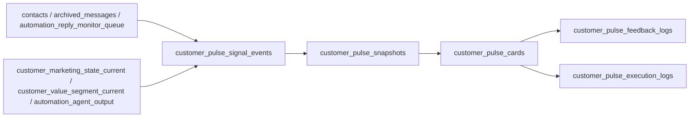

# AI 客户推进收件箱设计

## 目标
- 产品名：`AI 客户推进收件箱（Customer Pulse Inbox）`
- 核心交互：不是聊天框，而是“今天该做什么”的行动卡流。
- 范围：只复用现有客户、会话、营销阶段、标签、AI 输出、后台权限与消息通道；不新接平台，不默认自动发送。

## 用户故事
- 作为销售/顾问，我打开后台后能直接看到今天优先处理哪些客户，而不是先自己翻聊天记录。
- 作为运营负责人，我希望每张卡都带证据，能追溯到消息、阶段、标签或 AI 输出，低置信度时自动降级。
- 作为管理员，我希望所有外发动作只先生成草稿，由人工确认，不允许静默自动发送。
- 作为产品/技术负责人，我希望尽量少改老表，把新增状态沉淀在独立的 `customer_pulse_*` 表里。
- 作为 SaaS 平台实现方，我希望兼容当前单租户后台，又能在需要时切到 request-scoped tenant mode，对 Customer Pulse 读写做显式租户边界和默认拒绝。

## 页面流
1. 工作台
- Feature flag `ai_customer_pulse` 开启后，在侧边栏、工作台快捷入口、待处理事项里出现“客户推进”入口。

2. 客户推进收件箱 `/admin/customer-pulse`
- 顶部显示收件箱说明、草稿说明、汇总卡片。
- 中部显示行动卡列表。
- 每张卡显示：客户、当前阶段、优先级、建议动作、证据、草稿、最近更新时间。
- 页面根节点注入 `mode/tenant_key/actor_userid/actor_role`，前端请求自动回传 `X-Tenant-Key`、`X-Admin-Userid`、`X-Admin-Role`。
- 卡片主动作只落在已有能力上：
  - 生成回复草稿
  - 创建本地跟进任务占位
  - 更新跟进阶段
  - 设置下次提醒
- 标签更新先保留后端骨架，不强行做前端主入口。

3. 卡片执行
- `generate_reply_draft`：只生成草稿，不发送。
- `update_followup_segment`：复用现有 `set_manual_followup_segment(...)`。
- `create_followup_task`：先落本地执行日志与完成状态，不发明新任务系统。
- `set_followup_reminder`：先落本地 `due_at / snooze_until`。

## 状态机
### 卡片状态
- `open`：待处理。
- `draft_ready`：已生成草稿，等待人工确认下一步。
- `snoozed`：已设置提醒，暂缓处理。
- `completed`：动作已执行完成。
- `dismissed`：人工忽略。

### 触发关系
- `open -> draft_ready`
  - 人工点击“生成回复草稿”。
- `open -> snoozed`
  - 人工点击“明天提醒我”或执行提醒动作。
- `open|draft_ready|snoozed -> completed`
  - 人工确认动作已落地。
- `open|draft_ready|snoozed -> dismissed`
  - 人工明确忽略。
- `snoozed|completed|dismissed -> open`
  - 有更新证据且 `source_updated_at` 晚于已有卡片，或人工手动 reopen。

## 异常流
- Feature flag 关闭：页面只展示占位提示，API 返回 `enabled=false` 或动作错误。
- 证据不足：不展示 AI 草稿，降级成规则建议，或直接不生成行动卡。
- AI 置信度低：沿用现有 `customer_center.pulse_service` 的降级逻辑，只保留规则建议和证据。
- 营销阶段不可切换：复用现有 `set_manual_followup_segment(...)` 的报错信息。
- 标签建议缺少 tag id：接口保留，但返回“当前卡片没有可执行的标签建议”。
- `request_scoped` 模式下缺少 tenant、缺少 actor、tenant policy 缺失、跨 owner、角色不在 allowlist：统一拒绝，不降级为匿名读。
- evidence 跨租户访问：统一按卡片归属 owner + tenant 范围拒绝，不返回宽范围证据。

## 权限流
- 模式分层：
  - `legacy_internal`
  - 兼容当前单租户后台管理台口径；未显式传入 tenant 时，Customer Pulse 使用默认 tenant `aicrm`。
  - `request_scoped`
  - 对外 SaaS 租户口径；所有 Customer Pulse 读写必须显式携带 tenant context 和 actor context。
- 请求级上下文：
  - tenant 来源：`X-Tenant-Key`、`X-Customer-Pulse-Tenant`、`tenant_key`
  - actor 来源：`X-Admin-Userid`、`X-Admin-Role`，表单和 JSON 也接受 `admin_userid/admin_role`
- 访问策略：
  - 配置项：`CUSTOMER_PULSE_TENANT_ACCESS_POLICY_JSON`
  - 每个 tenant 定义 `owner_userids`、`member_userids`、`viewer_roles`、`operator_roles`、`internal_roles`
- 默认拒绝：
  - `request_scoped` 下无 tenant、无 actor、无 actor role、tenant 未配置 policy、actor 不在 tenant member 列表、tenant 没有 owner scope，全部返回 403。
- 读权限：
  - `ops/admin` 可查看 tenant allowlist 内全部 owner。
  - `sales/delivery` 只能看自己负责的客户；强行带其他 `owner_userid` 过滤也返回 403。
- 动作权限：
  - 表单页与 JSON API 继续走 `validate_admin_console_action_token()`。
  - 同时要求 actor role 落在 `operator_roles`，且目标客户 owner 在当前 tenant owner scope 内。
  - 执行、反馈、撤销、预览统一写 `customer_pulse_execution_logs`、`customer_pulse_feedback_logs` 与后台 `admin_operation_logs`。
- 内部作业权限：
  - `/api/internal/customer-pulse/recompute`、`/api/internal/customer-pulse/run-due` 继续要求 internal bearer token。
  - `request_scoped` 下额外要求 actor role 命中 `internal_roles`。
- 外发动作：
  - 当前只允许“生成草稿”，禁止默认自动发送。

## 输入与证据来源
### 直接复用的现有表
- 会话/聊天：
  - `archived_messages`
  - `automation_reply_monitor_queue`
- 客户：
  - `contacts`
  - `external_contact_bindings`
  - `people`
  - `wecom_external_contact_identity_map`
- 阶段/商机近似体：
  - `customer_marketing_state_current`
  - `customer_value_segment_current`
- 标签：
  - `contact_tags`
- AI：
  - `automation_agent_output`
  - `automation_agent_run`

### 新增表
- `customer_pulse_signal_events`
  - 收敛“为什么要生成这张卡”的底层信号。
  - `tenant_key` + `signal_key` 共同形成租户内幂等边界。
- `customer_pulse_snapshots`
  - 存一轮聚合后的判断快照，保留证据、推荐动作、AI 原始载荷。
  - 每条快照显式绑定 `tenant_key`。
- `customer_pulse_cards`
  - 用户真正看到的行动卡。
  - `tenant_key` + `card_key` 约束跨租户读写和卡片回放。
- `customer_pulse_feedback_logs`
  - 记录人工完成、忽略、延期、重开等反馈。
  - 反馈记录显式带 `tenant_key`，便于审计和隔离。
- `customer_pulse_execution_logs`
  - 记录每次动作执行、请求载荷、结果载荷、错误。
  - 执行日志显式带 `tenant_key`，便于幂等与撤销。
- `customer_pulse_action_feedback`
  - 记录“采纳 / 改写后发送（当前 MVP 为改写后保存草稿）/ 忽略 / 误判 / 无帮助”等学习反馈。
- `customer_pulse_metric_events`
  - 记录曝光、点击、草稿确认、任务创建、阶段更新、忽略、AI 错误、写回成功率等埋点。
- `user_ops_deferred_jobs`
  - 复用现有 deferred job 体系承载 `customer_pulse_recompute`。
  - 新增 `tenant_key`，保证重算作业与卡片、快照处于同一租户边界。

## 核心实体关系

## 存储模型
### `customer_pulse_signal_events`
- 作用：幂等保存当前动作信号。
- 关键字段：
  - `tenant_key`
  - `signal_key`：幂等键，形如 `external_userid:pending_reply`
  - `signal_type`：`pending_reply` / `ai_output` / `high_intent_segment` / `high_intent_tag` / `stale_followup`
  - `signal_source`：来源表
  - `evidence_json`：证据片段
  - `payload_json`：来源补充信息

### `customer_pulse_snapshots`
- 作用：保存某次聚合后的判断快照。
- 关键字段：
  - `tenant_key`
  - `summary`
  - `confidence`
  - `recommended_action_type`
  - `evidence_json`
  - `ai_payload_json`
  - `signals_json`

### `customer_pulse_cards`
- 作用：收件箱展示实体。
- 关键字段：
  - `tenant_key`
  - `card_key`
  - `snapshot_id`
  - `card_status`
  - `priority`
  - `title`
  - `summary`
  - `suggested_action_type`
  - `suggested_action_payload_json`
  - `draft_message`
  - `due_at`
  - `snooze_until`
  - `source_updated_at`

### `customer_pulse_feedback_logs`
- 作用：记录人工对卡片的反馈。
- 关键字段：
  - `tenant_key`
  - `feedback_type`
  - `feedback_value`
  - `note`
  - `operator`

### `customer_pulse_execution_logs`
- 作用：记录卡片动作执行结果。
- 关键字段：
  - `tenant_key`
  - `action_type`
  - `execution_status`
  - `channel_type`
  - `request_payload_json`
  - `result_payload_json`
  - `error_message`

### `user_ops_deferred_jobs`
- 作用：承载 Customer Pulse 增量重算作业。
- 关键字段：
  - `tenant_key`
  - `job_type='customer_pulse_recompute'`
  - `external_userid`
  - `owner_userid`
  - `status/run_after/attempt_count`

## 字段归属
### 直接来自现有表
- 客户名：`contacts.customer_name`
- 负责人：`contacts.owner_userid`
- 手机号：`people.mobile`
- 当前阶段：`customer_marketing_state_current.main_stage/sub_stage`
- 当前价值分层：`customer_value_segment_current.segment`
- 待回复窗口：`automation_reply_monitor_queue.*`
- 最近 AI 草稿/建议：`automation_agent_output.*`
- 标签证据：`contact_tags.tag_name`

### 新增落库
- 信号生命周期：`customer_pulse_signal_events`
- 聚合快照：`customer_pulse_snapshots`
- 卡片状态与草稿状态：`customer_pulse_cards`
- 人工反馈：`customer_pulse_feedback_logs`
- 执行动作日志：`customer_pulse_execution_logs`
- 租户与作业边界：`customer_pulse_*` 全表 `tenant_key` + `user_ops_deferred_jobs.tenant_key`

### 不改动的老表
- 不改动客户、商机、会话、标签等事实业务表字段。
- 允许对基础设施表做最小增量：
  - `app_settings` 新增 Customer Pulse 配置项
  - `user_ops_deferred_jobs` 新增 `tenant_key`，承载 tenant-aware recompute job

## API 设计
### 页面
- `GET /admin/customer-pulse`
- `POST /admin/customer-pulse/actions/refresh`
- `POST /admin/customer-pulse/cards/<card_id>/actions/execute`
- `POST /admin/customer-pulse/cards/<card_id>/feedback`

### JSON API
- `GET /api/admin/customer-pulse`
- `GET /api/admin/customer-pulse/cards/<card_id>`
- `POST /api/admin/customer-pulse/actions/refresh`
- `POST /api/admin/customer-pulse/cards/<card_id>/actions/preview`
- `POST /api/admin/customer-pulse/cards/<card_id>/actions/execute`
- `POST /api/admin/customer-pulse/cards/<card_id>/feedback`

### Internal API
- `GET /api/internal/customer-pulse/inbox`
- `GET /api/internal/customer-pulse/customer/<external_userid>`
- `POST /api/internal/customer-pulse/recompute`
- `POST /api/internal/customer-pulse/run-due`

### 请求约定
- `request_scoped` 模式下，Customer Pulse 页面和 widget 请求都带：
  - `X-Tenant-Key`
  - `X-Admin-Userid`
  - `X-Admin-Role`
- HTML 表单动作同时透传：
  - `tenant_key`
  - `admin_userid`
  - `admin_role`

## 推荐技术路线
1. 先复用现有 `build_customer_pulse(external_userid)`
- 单客户 AI/规则降级逻辑已经存在，不需要重写。
- 收件箱层只负责聚合、排队、状态机与动作执行。

2. 用新表做“读写边界”
- 老表继续做事实源。
- 新表只做“行动卡上下文层”，避免污染现有客户、营销与消息模型。
- 读写边界显式加 `tenant_key`，并复用 `user_ops_deferred_jobs` 做 tenant-aware 增量重算。

3. 动作优先复用已有服务
- 回复草稿：复用现有 pulse 草稿和规则模板。
- 跟进阶段：复用 `set_manual_followup_segment(...)`。
- 标签：复用 `mark_customer_tags(...) / unmark_customer_tags(...)`。
- 提醒/任务：先本地化，不额外发明外部系统集成。

4. 租户模式显式双轨
- 当前管理台继续跑 `legacy_internal`，保持兼容。
- 外放 SaaS 环境切换到 `request_scoped`，Customer Pulse 除 legacy mode 外全部要求 request-level tenant context，默认拒绝。

## 可执行实施清单
- [x] 新建设计文档 `02-design.md`
- [x] 新增 `customer_pulse_*` 表与日志表，并给 `user_ops_deferred_jobs` 增加 tenant 边界字段
- [x] 新建 `domains/customer_pulse`
- [x] 新建 `/admin/customer-pulse` 页面与 JSON API
- [x] 接入 feature flag `ai_customer_pulse`
- [x] 接入后台导航、工作台快捷入口、待处理事项
- [x] 接入筛选：我的客户 / 全部、阶段、风险、超期、草稿、高优先级、搜索
- [x] 接入反馈学习与关键埋点
- [x] 对外暴露 `whyNow + evidenceRefs`，并保留可回跳证据链
- [x] 接入 `legacy_internal` / `request_scoped` 双模式、tenant policy 和默认拒绝
- [ ] 补分页、批量动作
- [ ] 增加标签建议生成策略与更细粒度回溯
