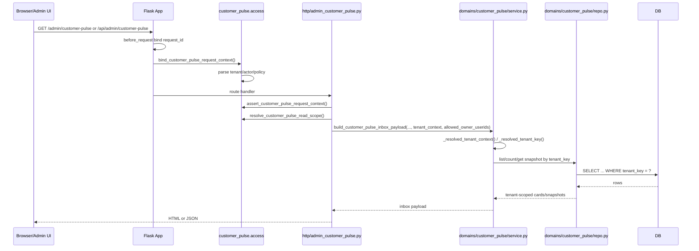
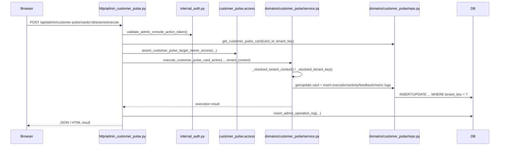
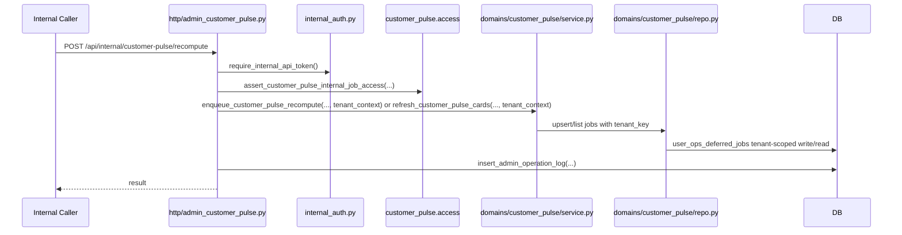

# AI Customer Pulse 租户与鉴权审计

审计时间：2026-04-11
审计方式：代码扫描 + 实际实现核对；本文档已同步到当前仓库实现。
审计范围：middleware、request context、auth、token、admin 页面鉴权、repo 查询入口、审计日志，以及 Customer Pulse 相关调用链。

## 一句话结论

当前仓库没有“全局 tenant middleware”或“全局 admin auth middleware”。

- 请求级上下文目前只有两类 app 级绑定：
  - `request_id`
  - `customer_pulse_access_context`
- 内部接口鉴权主要靠 `Authorization: Bearer <token>` 的 handler 级校验。
- admin 写动作保护主要靠 session 内的 `admin_action_token`，它更像确认/防误触 token，不是身份系统，也不是权限系统。
- Customer Pulse 是目前唯一已经形成“request-scoped tenant context -> service kill switch -> repo tenant filter -> tenant-aware storage”的独立子域。
- 仓库其余 CRM/客户/时间线/运营/自动化主链，仍然以单租户、全局表、`external_userid` 全局唯一、全局配置/全局角色映射为默认假设。

结论上，Customer Pulse 最合理的注入点不是去全仓库推 tenant，而是继续把它当成一个“tenant-aware island”：

1. 在 Flask app `before_request` 绑定 request-scoped tenant/auth context。
2. 在 `http/admin_customer_pulse.py` 和 `domains/admin_console/customer_profile_service.py` 做入口级 scope 收口。
3. 在 `domains/customer_pulse/service.py::_resolved_tenant_context()` / `_resolved_tenant_key()` 做服务层显式 tenant 闸门。
4. 在 `domains/customer_pulse/repo.py` 和 `user_ops_deferred_jobs` 上继续维持显式 tenant filter。

这条路线爆炸半径最小，也最符合当前仓库结构。

## 0. 当前实施状态

本轮 request-scoped tenant context 已实际落到代码：

- `before_request` 继续绑定 `g.customer_pulse_access_context`
- `CustomerPulseTenantContext` 已收敛成统一结构，至少包含：
  - `tenant_key`
  - `user_id`
  - `role`
  - `source`
  - `auth_mode`
  - `legacy_mode`
  - `error_code` / `error_message` / `http_status`
- `domains/customer_pulse/service.py` 的 public service / executor 入口已显式接收 `tenant_context` 或 `tenant_key`
- service 层已移除“隐式读取当前 request access context 再 fallback”的路径
- `legacy_internal` 不再偷偷 fallback；内部后台 / callback / archive / demo seed 改为显式构造 `build_customer_pulse_legacy_tenant_context(...)`
- 缺失 tenant、非法 tenant、冲突 tenant 会返回明确错误码：
  - `tenant_context_required`
  - `tenant_invalid`
  - `tenant_context_conflict`
- Customer Pulse API / 页面 payload 与审计日志现在都会带 `tenant_context` 摘要，能区分 `legacy_internal` 和 `request_scoped`

## 1. 当前 tenant / auth / request 流

### 1.1 App 级 request context

当前 Flask app 只有两个 `before_request`：

- `wecom_ability_service/observability.py`
  - 绑定 `g.request_id`
  - 在 `after_request` 回写 `X-Request-Id`
- `wecom_ability_service/__init__.py`
  - 绑定 `g.customer_pulse_access_context`
  - 由 `domains/customer_pulse/access.py::bind_customer_pulse_request_context()` 完成

没有全局 tenant middleware，也没有全局 admin login / permission middleware。

### 1.2 DB request context

- `wecom_ability_service/db.py::get_db()`
  - 首次访问时把 DB 连接挂到 `g.db`
  - request 结束由 `close_db()` 释放
- 这层只负责连接生命周期，不参与 tenant 或 auth

### 1.3 配置读取

- `wecom_ability_service/infra/settings.py::get_setting(key)`
  - 从 `app_settings` 按 `key` 读单行配置
- 现状是全局配置，不带 tenant 维度
- `CUSTOMER_PULSE_TENANT_ACCESS_POLICY_JSON` 也是一条全局 JSON 配置，而不是 tenant 分表或 tenant scoped setting

### 1.4 Internal token

- `wecom_ability_service/http/internal_auth.py::require_internal_api_token()`
  - 读取 `Authorization: Bearer <token>`
  - 或 legacy header
  - 对比 `AUTOMATION_INTERNAL_API_TOKEN` / 指定 token key
- 这是共享服务凭证，不带 tenant 信息

### 1.5 Admin action token

- `ensure_admin_console_action_token()`
  - 把 token 存进 session：`admin_console_action_token`
- `validate_admin_console_action_token()`
  - 从 form / query / json 读 `admin_action_token`
  - 与 session token 比对

注意：

- 这不是后台登录系统
- 这不是 RBAC
- 更像“当前浏览器会话里的确认 token / 防误触 token / 弱 CSRF 式保护”

### 1.6 Admin operator / actor 来源

当前仓库没有统一的“后台操作者解析器”，而是按模块散落：

- 很多 admin handler 直接读：
  - `X-Admin-Operator`
  - `operator`
  - form/json 里的 `operator`
- `domains/user_ops/service.py::_current_user_ops_operator()`
  - 只尝试从 session 读 `userid/user_id/username`
  - 没有统一登录态协议
- Customer Pulse 例外：
  - 优先解析 `X-Admin-Userid`、`X-Admin-Role`
  - 再结合 `owner_role_map` 做角色识别
  - 再进入 tenant policy 校验

### 1.7 审计日志

- `domains/admin_config/repo.py::insert_admin_operation_log(...)`
  - 写 `admin_operation_logs`
  - 字段是 `operator/action_type/target_type/target_id/before_json/after_json`
- 当前表没有 `tenant_key` 列
- Customer Pulse 已经把 `tenant_key` 塞进 `before_json/after_json`
- 所以现在 tenant 审计依赖 JSON 载荷，不是结构化索引字段

## 2. 当前哪些模块天然是单租户假设

### 2.1 全局单租户假设较强的模块

| 模块 | 当前假设 | 说明 |
| --- | --- | --- |
| `customer_center/*` | 单租户 | 客户列表/详情按 `external_userid` 全局查询，不带 tenant |
| `customer_timeline/*` | 单租户 | timeline 聚合按 `external_userid` 查多张全局表 |
| `automation_conversion/*` | 单租户 | 自动化成员、reply monitor、agent output、SOP 都是全局表 |
| `admin_config/*` | 单租户 | `app_settings`、`owner_role_map`、routing rules 都是全局配置 |
| `admin_audit/*` | 单租户 | `admin_operation_logs` 无 tenant 结构化字段 |
| `tasks / tags / sidebar` | 单租户 | 默认按客户/owner 执行，没有 tenant 过滤 |
| `archive / callbacks / background_jobs` | 单租户 | 事件生产链没有 tenant mapping，靠 legacy fallback 继续运行 |

### 2.2 典型单租户信号

- 大部分事实表没有 `tenant_key`
- 大部分 repo 查询只按：
  - `external_userid`
  - `owner_userid`
  - `person_id`
  - `mobile`
- `app_settings` 是全局键值表
- `owner_role_map` 是全局 userid -> role 映射
- `external_userid` 基本被当作仓库内全局唯一客户键
- admin 页面路由直接注册，没有 page-level auth middleware

## 3. 当前哪些模块已经具备 tenant field / tenant_key

当前 tenant 化几乎只集中在 Customer Pulse 子域和其 recompute job：

| 表 / 模块 | tenant 现状 | 说明 |
| --- | --- | --- |
| `user_ops_deferred_jobs` | 有 `tenant_key` | 用于 `customer_pulse_recompute` 作业 |
| `customer_pulse_signal_events` | 有 `tenant_key` | 信号层 |
| `customer_pulse_snapshots` | 有 `tenant_key` | 快照层 |
| `customer_pulse_cards` | 有 `tenant_key` | 卡片层 |
| `customer_pulse_feedback_logs` | 有 `tenant_key` | 反馈层 |
| `customer_pulse_execution_logs` | 有 `tenant_key` | 执行日志 |
| `customer_pulse_activity_logs` | 有 `tenant_key` | 写回活动日志 |
| `customer_pulse_action_feedback` | 有 `tenant_key` | 学习反馈 |
| `customer_pulse_metric_events` | 有 `tenant_key` | 埋点事件 |
| `domains/customer_pulse/access.py` | request-scoped tenant access | 解析 headers / form / query / json 并做 policy 校验 |
| `domains/customer_pulse/service.py` | service kill switch | `_resolved_tenant_key()` 在 request-scoped 下默认拒绝无 tenant |
| `domains/customer_pulse/repo.py` | repo tenant filter | 读写显式带 `tenant_key` |
| `http/admin_customer_pulse.py` | 入口鉴权 + owner scope | 读、写、internal job 都在这里收口 |
| `domains/admin_console/customer_profile_service.py` | widget 读入口已接 tenant scope | 客户详情侧 AI widget 已走同一套 scope |
| `templates/static` | tenant/actor 头透传 | 页面 dataset -> JS fetch headers |

结论：

- 当前仓库不是“全局 tenant 化”
- 而是“Customer Pulse 已经被切成一个 tenant-aware 子域”

## 4. Customer Pulse 的完整调用链

### 4.1 页面 / JSON 读链路

### 4.2 页面渲染后的前端请求链路

- `customer_pulse_inbox.html` / `customer_detail.html`
  - 在 DOM dataset 注入：
    - `mode`
    - `tenant_key`
    - `actor_userid`
    - `actor_role`
- `customer_pulse_inbox.js` / `customer_profile.js`
  - 自动把这些值回传为：
    - `X-Tenant-Key`
    - `X-Admin-Userid`
    - `X-Admin-Role`

这意味着：

- tenant / actor 上下文不是只靠 SSR
- 后续 preview / execute / feedback / undo 的 AJAX 请求也能保持同一上下文

### 4.3 写动作链路

### 4.4 Internal recompute 链路

## 5. 当前 Customer Pulse request/auth/tenant 关键节点

### 5.1 Request context 绑定点

当前最合理、也已经存在的注入点就是：

- `wecom_ability_service/__init__.py`
  - `@app.before_request`
  - `_bind_customer_pulse_access()`

原因：

- 是当前唯一的 app 级业务上下文绑定点
- 所有 HTTP controller 都能消费 `g.customer_pulse_access_context`
- 不需要去每个 route 手写 tenant 解析

### 5.2 HTTP 入口收口点

当前 Customer Pulse 读写入口只集中在两处：

- `wecom_ability_service/http/admin_customer_pulse.py`
  - 收件箱页、卡片 API、preview、execute、feedback、undo、internal APIs
- `wecom_ability_service/domains/admin_console/customer_profile_service.py`
  - 客户详情页 AI widget 的读入口

这两个点是最小爆炸半径的入口收口点。

### 5.3 Service tenant gate

- `domains/customer_pulse/service.py::_resolved_tenant_context()`
- `domains/customer_pulse/service.py::_resolved_tenant_key()`

这是当前最重要的服务层防线：

- public service / executor 入口必须显式传 `tenant_context` 或 `tenant_key`
- service 层不再隐式读取当前 request access context
- `legacy_internal` 调用必须显式构造 `build_customer_pulse_legacy_tenant_context(...)`
- `request_scoped` 下如果没有有效 tenant context，直接抛 `CustomerPulseAccessDenied`
- 如果显式 `tenant_key` 与 `tenant_context.tenant_key` 冲突，直接返回 `tenant_context_conflict`

这个点保证即使有新调用方绕过 HTTP controller，服务层仍能拒绝无 tenant、非法 tenant 和冲突 tenant 请求。

### 5.4 Repo tenant 过滤点

`domains/customer_pulse/repo.py` 已经形成明确模式：

- 存储表读写统一带 `tenant_key`
- `WHERE tenant_key = ?`
- `card_key` / `signal_key` 已带租户前缀语义
- recompute jobs 也 tenant-aware

这说明 repo 层已经适合作为最终隔离边界。

## 6. 现有单租户假设点

### 6.1 没有全局 admin 页面鉴权

现状：

- `/admin/*` 路由直接注册
- 没有 `login_required`
- 没有统一 admin session auth middleware
- 没有统一 permission decorator

影响：

- 当前后台更像“部署边界内的内部管理台”
- 不是面向互联网 SaaS 的完整后台权限模型

### 6.2 admin action token 使用不均匀

现状：

- `admin_customer_pulse.py`、`admin_jobs.py`、`automation_conversion.py` 明确校验 `validate_admin_console_action_token()`
- 但 `admin_customers.py`、`admin_operations.py`、`admin_mcp.py`、`admin_config.py` 等 admin POST 路由并不都统一校验

影响：

- `admin_action_token` 目前是局部治理手段，不是全后台一致标准

### 6.3 operator / actor 解析不统一

现状：

- 有的模块读 `X-Admin-Operator`
- 有的模块读 form/json `operator`
- `user_ops` 又读 session `userid/user_id/username`
- Customer Pulse 单独引入 `X-Admin-Userid` + `X-Admin-Role`

影响：

- 当前“谁在操作后台”没有统一 contract
- 如果后续 tenant 化扩散，容易出现 operator / actor 语义不一致

### 6.4 上游事实源仍是全局表

Customer Pulse 的 source reads 仍主要来自：

- `contacts`
- `archived_messages`
- `automation_reply_monitor_queue`
- `automation_agent_output`
- `customer_marketing_state_current`
- `customer_value_segment_current`
- `contact_tags`
- `questionnaire_submissions`
- `conversion_dispatch_log`
- `wecom_external_contact_follow_users`

这些表没有 tenant_key。

影响：

- Customer Pulse 的 tenant 隔离目前主要靠：
  - 输出层 tenant-bound storage
  - owner scope 限制
- 不是靠上游事实源天然 tenant 隔离

### 6.5 customer_timeline 回流口仍是单租户读取

`customer_timeline/repo.py` 当前：

- `has_customer_timeline_scope(external_userid)` 不带 tenant
- `fetch_customer_pulse_activity_logs(external_userid)` 不带 tenant

影响：

- 如果未来 `external_userid` 不再全局唯一，或租户间可重复，timeline 会有回流泄漏风险
- 这属于 Customer Pulse 外放时必须优先关注的 read-back 风险点

### 6.6 全局配置 / 全局角色映射

当前以下都是全局对象：

- `app_settings`
- `owner_role_map`
- routing rules
- `admin_operation_logs`

影响：

- tenant policy 目前是“全局 JSON 配置里的 tenant map”
- owner role 也是全局 userid -> role
- 如果未来出现跨 tenant 相同 userid 命名空间，这会成为隐患

## 7. 建议的 request-scoped tenant context 注入方案

### 7.1 目标

只让 Customer Pulse 先具备外放所需的 request-scoped tenant/auth context，不把 tenant 逻辑扩散到全仓库。

### 7.2 建议方案

#### 方案 A：沿用现有 Customer Pulse 专属 binder，继续局部演进

推荐作为当前阶段方案。

- 继续在 `create_app()` 的 `before_request` 绑定 `g.customer_pulse_access_context`
- 解析 contract 继续保持：
  - tenant：`X-Tenant-Key` / `X-Customer-Pulse-Tenant` / `tenant_key`
  - actor：`X-Admin-Userid` / `X-Admin-Role`
- 继续由 `CUSTOMER_PULSE_TENANT_ACCESS_POLICY_JSON` 提供 tenant allowlist
- 继续由 `resolve_customer_pulse_read_scope()` / `assert_customer_pulse_target_owner_access()` 收口 owner scope

优点：

- 改动范围最小
- 不破坏现有非 Customer Pulse 模块
- 当前代码已经基本按这条路径落地

缺点：

- 是子域专属上下文，不是全局统一 admin request context

#### 方案 B：抽一层通用 `admin_request_context`

适合下一阶段，但不建议作为本轮先手。

- 新建统一的 `g.admin_request_context`
- Customer Pulse 只是其中一个 consumer
- 未来 admin_config、automation_conversion、jobs 等模块也能复用

优点：

- 结构更整齐

缺点：

- 会扩大改动面
- 需要统一 operator / actor / role 语义
- 会把本来已经稳定的 Customer Pulse 外放路径重新搅大

结论：

- 当前最小爆炸半径路线选 A
- 等 Customer Pulse 外放稳定后，再决定是否抽象成通用 admin context

## 8. legacy internal mode 的兼容策略

### 8.1 继续保留默认模式

`legacy_internal` 应继续作为当前单租户管理台默认模式：

- 默认 tenant：`aicrm`
- 不强制要求请求头里的 tenant/actor
- 内部回调、归档、后台脚本、手工刷新仍可运行

### 8.2 为什么不能立刻强推全 request-scoped

因为以下生产链路现在还没有天然 tenant mapping：

- `archive/service.py` 新消息入库后触发 Pulse recompute
- `http/background_jobs.py` 企微 callback 触发 Pulse recompute
- 其他 internal scripts / jobs

这些调用方当前都依赖 legacy fallback。

### 8.3 兼容策略

- 内部管理台、回调消费、archive sync、demo seed、dashboard 继续跑 `legacy_internal`
- 这些 legacy 调用方不再依赖隐式 fallback，而是显式传 `build_customer_pulse_legacy_tenant_context(...)`
- 对外 SaaS 入口单独切 `request_scoped`
- request-scoped 模式下禁止依赖“无 tenant 参数的后台作业触发”

## 9. 风险点

### 高风险

1. `customer_timeline` 读取 `customer_pulse_activity_logs` 没有 tenant filter
2. 上游事实源全局表无 tenant_key，当前只能靠 owner scope 间接收口
3. `owner_role_map` 与 `app_settings` 是全局对象，不是 tenant-scoped config
4. admin 页面没有全局 auth middleware

### 中风险

1. `admin_action_token` 使用不均匀
2. operator / actor 解析不统一
3. `admin_operation_logs` 无结构化 tenant 字段，只能在 JSON 内查

### 低风险 / 可接受现状

1. Customer Pulse 自身存储层 tenant-aware
2. Customer Pulse HTTP 入口已具备 deny-by-default
3. Customer Pulse service 层已具备 tenant kill switch

## 10. 建议的迁移顺序

### 第 1 步：稳住 Customer Pulse 子域边界

- 保持 app.before_request 绑定 `customer_pulse_access_context`
- 所有 Customer Pulse HTTP 入口继续只认 request-scoped context
- service 层继续把 `_resolved_tenant_key()` 作为硬闸

### 第 2 步：固定外部接入 contract

- 网关 / BFF / 页面容器稳定透传：
  - `X-Tenant-Key`
  - `X-Admin-Userid`
  - `X-Admin-Role`
- 对 internal caller 明确：
  - bearer token 继续保留
  - request-scoped 模式下还要补 tenant + actor

### 第 3 步：先补回流读口，不碰主 CRM 事实表

优先补：

- `customer_timeline` 对 `customer_pulse_activity_logs` 的 tenant 过滤
- 必要时补 customer detail / timeline 的 Pulse read-back 保护

暂不动：

- `customer_center` 全量 repo
- `automation_conversion` 全量 repo
- `questionnaire` / `tags` / `tasks` / `sidebar` 主链

### 第 4 步：再考虑通用 admin request context

只有在以下条件满足后再做：

- Customer Pulse 外放链路稳定
- tenant/actor contract 已固定
- 需要把同样机制扩散到更多后台模块

## 11. 最小爆炸半径技术路线

### 先改 / 先守住的点

1. `create_app()` 的 request binder
2. `domains/customer_pulse/access.py`
3. `http/admin_customer_pulse.py`
4. `domains/admin_console/customer_profile_service.py`
5. `domains/customer_pulse/service.py`
6. `domains/customer_pulse/repo.py`
7. `user_ops_deferred_jobs`
8. Customer Pulse 模板与 JS 的 tenant/actor 头透传

其中 1-5、7、8 已落地；6 仍保持“显式 tenant_key 过滤，不读全局上下文”的 repo 边界模式。

### 暂不动的点

1. 全局 admin login 体系
2. 全局 permission / ABAC 框架
3. `customer_center` 全量 repo tenant 化
4. `automation_conversion` 全量 repo tenant 化
5. `app_settings` 改成 tenant-scoped settings store
6. `owner_role_map` 改成 tenant-scoped role registry
7. 全量历史表补 tenant_key

### 推荐结论

当前 Customer Pulse 最合理的注入点有三个：

1. `Flask before_request`
   - 负责把 request-scoped tenant/auth context 绑定到 `g`
2. `Customer Pulse HTTP 入口`
   - 负责把 tenant context 转成 read scope / operator scope / internal job scope
3. `Customer Pulse service::_resolved_tenant_key()`
   - 负责兜底拒绝任何绕过 HTTP 的无 tenant 调用

这三个点已经天然形成“入口收口 + 服务兜底 + repo 隔离”的闭环。

在不重构全仓库 auth/tenant 架构的前提下，这是当前最稳、最便宜、最可上线的路线。

## 12. 关键源码入口

- `wecom_ability_service/__init__.py`
- `wecom_ability_service/observability.py`
- `wecom_ability_service/http/internal_auth.py`
- `wecom_ability_service/infra/settings.py`
- `wecom_ability_service/http/admin_customer_pulse.py`
- `wecom_ability_service/domains/customer_pulse/access.py`
- `wecom_ability_service/domains/customer_pulse/service.py`
- `wecom_ability_service/domains/customer_pulse/repo.py`
- `wecom_ability_service/domains/admin_console/customer_profile_service.py`
- `wecom_ability_service/customer_timeline/repo.py`
- `wecom_ability_service/domains/admin_config/repo.py`
