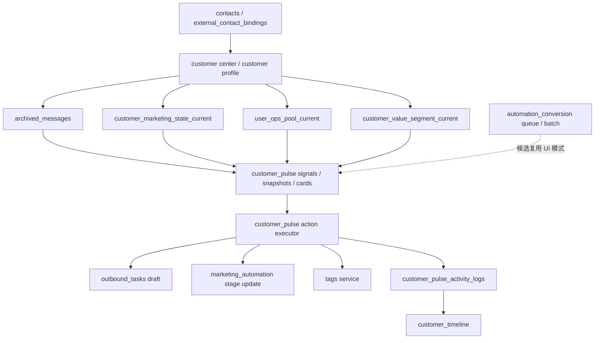
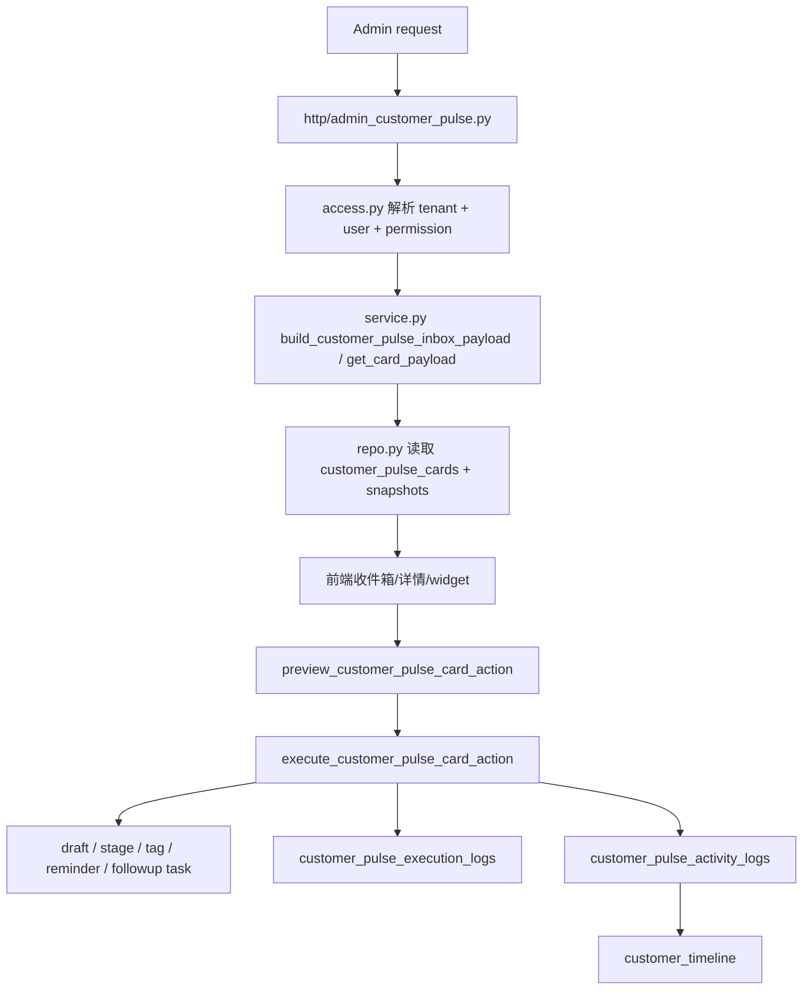

# AI 团队跟进编排器当前审计

## 1. 审计范围

本次审计仅覆盖现有仓库内与团队跟进编排直接相关的模块，不做结构重构。

重点扫描对象：

- `wecom_ability_service/domains/customer_pulse/*`
- `wecom_ability_service/http/admin_customer_pulse.py`
- `wecom_ability_service/customer_timeline/*`
- `wecom_ability_service/domains/tasks/*`
- `wecom_ability_service/domains/marketing_automation/*`
- `wecom_ability_service/domains/automation_conversion/*`
- `wecom_ability_service/customer_center/*`
- `wecom_ability_service/domains/admin_console/*`
- `wecom_ability_service/domains/routing_config/*`
- `wecom_ability_service/schema.sql`

结论先行：

- 当前仓库里，`owner` 是强实体，`team / manager / approval / claim / reassign` 不是强实体。
- 现有最稳定、最适合复用的入口不是营销自动化，也不是任务中心，而是 `customer_pulse` 现有的卡片、权限、审计、执行链路。
- 团队编排器最小爆炸半径做法，应当是叠加在 `customer_pulse action card` 之上，形成“任务包 / 波次 / 转派建议 / 升级 / 接力”的编排层，而不是重做底层 action executor。

## 2. 核心实体关系

### 2.1 当前真正稳定存在的实体

- 客户：
  - `contacts`
  - `external_contact_bindings`
  - `class_user_status`
- 负责人：
  - `owner_userid`
  - `owner_role_map`
- 客户生命周期 / 池 / 阶段：
  - `customer_marketing_state_current`
  - `user_ops_pool_current`
  - `customer_value_segment_current`
- 客户推进：
  - `customer_pulse_snapshots`
  - `customer_pulse_cards`
  - `customer_pulse_execution_logs`
  - `customer_pulse_activity_logs`
  - `customer_pulse_action_feedback`
- 外发草稿 / 任务传输：
  - `outbound_tasks`
- 自动化队列 / 波次：
  - `automation_reply_monitor_queue`
  - `automation_focus_send_batch`
  - `automation_focus_send_batch_item`
  - `automation_sop_batch`
  - `automation_sop_batch_item`

### 2.2 当前不存在或不成体系的实体

- 没有发现独立的 `team` 主表。
- 没有发现独立的 `manager -> subordinate` 组织树。
- 没有发现 CRM 级别的 `claim / reassign / approval / escalation` 业务表。
- 没有发现标准化的 `deal` / `opportunity` 独立领域模型，更多是通过营销阶段、客户池、价值分层表达商机状态。

## 3. assignment / owner / team 现状

### 3.1 owner 是当前最稳定的执行归属字段

仓库中大量核心表都直接挂 `owner_userid`，包括：

- `contacts`
- `external_contact_bindings` 的 `first_owner_userid / last_owner_userid`
- `user_ops_pool_current`
- `customer_marketing_state_current` 的关联读模型
- `customer_pulse_cards`
- `customer_pulse_activity_logs`
- `automation_reply_monitor_queue`

这意味着：

- 当前系统天然擅长表达“这个客户现在归谁负责”。
- 任何新增编排能力，都应该先围绕 `owner_userid` 做分组、转派建议和接力，而不是先引入全新 assignment 模型。

### 3.2 团队不是一等业务实体，而是隐式边界

目前最接近“团队范围”的能力不是数据库里的 `team_id`，而是两层隐式约束：

1. `owner_role_map`
   - 维护 `userid / display_name / role / active`
   - 能表达“这个 owner 属于什么角色”，但不能表达团队组织树。
2. `customer_pulse` 的 tenant policy
   - 在 request-scoped tenant mode 下，tenant 配置可声明：
     - `owner_userids`
     - `member_userids`
     - `viewer_roles`
     - `operator_roles`
     - `internal_roles`
   - 这是当前最接近“团队成员集合”和“团队可见范围”的机制。

因此，AI 团队编排器如果要做“团队视图”，最稳妥的第一版应该是：

- 基于 tenant-scoped + allowed owner scope 构造团队视图；
- 不引入新的组织架构真相源；
- 先把“团队”定义为“当前 tenant policy 允许的 owner 集合”。

### 3.3 manager 视图目前没有独立模型

没有发现独立的：

- 经理视图 API
- 团队汇总 API
- 管理者审批流
- owner 转派审批表

当前最接近“团队总览”的现有能力：

- `customer_pulse` inbox / stats：支持按 owner scope 过滤
- `automation_conversion` overview / stage detail：支持看队列数量、批次状态、阶段聚合

这些能力可以提供 UI 和聚合思路，但不能直接当作“团队编排器”的业务模型。

## 4. 任务、状态流、队列、认领、审批现状

### 4.1 任务能力现状

`domains/tasks` 当前更像“外发任务与草稿传输层”，不是团队任务系统。

现有可复用能力：

- `save_local_private_message_draft(...)`
- `update_outbound_task_status(...)`
- `outbound_tasks.status`

现有不具备的能力：

- 没有标准任务 assignee 字段
- 没有任务转派
- 没有任务审批
- 没有认领队列
- 没有团队 SLA / 升级链

这意味着：

- 编排器不应把 `domains/tasks` 当作“团队工作流引擎”。
- 如果需要“任务包”或“波次”，应该建在 `customer_pulse` 之上，调用现有 executor，而不是强行扩展 `outbound_tasks`。

### 4.2 Customer Pulse action 状态流现状

当前 `customer_pulse` 已经具备完整的单卡执行闭环：

- 卡片生成：
  - signal -> snapshot -> card
- 卡片读取：
  - inbox/list/detail/widget
- 卡片执行：
  - preview -> confirm -> execute
- 卡片回写：
  - `customer_pulse_execution_logs`
  - `customer_pulse_activity_logs`
  - `customer_timeline`
- 卡片反馈：
  - `customer_pulse_action_feedback`
- 可逆动作：
  - `undo_customer_pulse_card_action_execution(...)`

当前支持的动作类型：

- `generate_reply_draft`
- `create_followup_task`
- `update_followup_segment`
- `update_tags`
- `set_followup_reminder`

注意：

- 这里的 `create_followup_task` 目前仍然是 Pulse 语义下的动作，不是成熟的团队任务分派系统。
- 对外消息链路已经满足“先草稿、再人工确认”，这是编排器必须复用、不能绕过的底层约束。

### 4.3 队列 / 波次 / claim 现状

`automation_conversion` 内存在一些“队列 / 批次 / claim”语义，但用途不同：

- `automation_reply_monitor_queue`
  - 用于消息命中后进入自动化处理队列
- `automation_focus_send_batch` / `_item`
  - 用于波次推送
- `claim_next_focus_send_batch_item(...)`
  - 用于技术上的批次项抢占，避免重复处理

这些概念不等于：

- 客服认领客户
- 团队转派
- 经理审批
- owner 接力

结论：

- 可借鉴其“批次 / 波次 / 概览 UI / 运行状态”的表现形式；
- 不建议直接拿来承载团队编排业务语义。

### 4.4 审批现状

未发现可直接复用的：

- 审批流领域模型
- 审批节点状态机
- owner 变更审批记录

因此编排器第一阶段不适合直接做重审批工作流。

更合理做法：

- 第一版只做“转派建议 + 人工确认”；
- 若需要审批，先做轻量“待确认编排动作”，不要直接上完整审批引擎。

## 5. customer_pulse 与任务 / 营销自动化的复用点

### 5.1 customer_pulse 可直接复用的能力

- feature flag：`ai_customer_pulse`
- tenant-scoped request context
- 页面级与动作级 RBAC
- inbox/list/detail/widget 读取链路
- evidenceRefs 安全输出
- preview-before-execute 执行模式
- action executor
- execution log / audit / metrics / feedback
- timeline writeback
- undo 短窗口撤销

这部分是团队编排器必须站在其上的底座。

### 5.2 营销自动化可复用的能力

- `customer_marketing_state_current` 的阶段 / 子阶段表达
- `user_ops_pool_current` 的客户池视角
- `customer_value_segment_current` 的价值分层
- `set_manual_followup_segment(...)` 作为既有阶段更新入口
- 已有波次与队列页面的表现形式

适合复用的点：

- 阶段和客户池词汇体系
- 团队波次页面的信息结构

不适合复用的点：

- 不应直接把编排器做成营销自动化的一部分
- 不应把团队动作塞进自动化 conversion runner

### 5.3 timeline / activity 的复用点

`customer_timeline` 已经接入 `customer_pulse_activity_logs`。

这意味着编排器执行后的所有团队动作，最稳妥的写回路径应该仍然是：

- 编排动作 -> 调用 Pulse executor 或其扩展 -> 写 `customer_pulse_activity_logs` -> 出现在 `customer_timeline`

不要新造第二套 customer history。

## 6. 从 action_card 到执行动作的当前链路

当前链路可以抽象为：

### 6.1 当前插入编排层的最合理位置

最合理位置有且只有一层：

- 放在 `customer_pulse` 的“卡片读取层”和“动作执行层”之间；
- 编排器负责：
  - 按 owner/team 聚合卡片
  - 形成任务包 / 波次 / 接力建议
  - 产出转派建议、升级建议、批量执行计划
- 底层动作仍由既有 `customer_pulse` action executor 落地

不建议的位置：

- 不要插到 `tasks` 底层，把它改成团队任务系统
- 不要插到 `marketing_automation` 核心阶段引擎里
- 不要插到 `automation_conversion` runner 里

## 7. 推荐的最小接入点

### 7.1 推荐接入点一：customer_pulse 上层新增 orchestrator 聚合服务

建议新增一个薄层 service，例如：

- `domains/followup_orchestrator/service.py`

职责仅包括：

- 基于现有 `customer_pulse_cards` 做聚合
- 输出：
  - team inbox
  - owner bucket
  - wave / package 建议
  - transfer / relay / escalation 建议
- 调用现有 `customer_pulse` executor 做真正执行

这是当前最小爆炸半径的主路径。

### 7.2 推荐接入点二：复用 admin_customer_pulse 的鉴权与页面风格

建议新增独立入口页，但沿用现有 admin console 体系：

- 复用 request-scoped tenant context
- 复用 customer_pulse 权限解析
- 复用 evidence 安全边界
- 复用现有卡片详情侧栏交互

也就是说，团队编排器应该更像 “customer_pulse 的团队工作台”，而不是新开一套前后台。

### 7.3 推荐接入点三：团队动作落地仍回到 pulse executor

团队编排器初期不应自带一套新的执行器。

推荐模式：

- orchestrator 产出编排计划
- 用户确认后，将计划拆成多个现有 action card action
- 逐条调用现有：
  - 草稿生成
  - 任务创建
  - 阶段更新
  - 标签更新
  - 提醒设置

这样可以直接继承：

- 草稿确认安全约束
- tenant-scoped RBAC
- execution log
- audit
- undo
- writeback

## 8. 不建议动的大模块

以下模块不适合在第一阶段大动：

### 8.1 `domains/customer_pulse` 底层 executor

理由：

- 已经过 tenant / RBAC / 审计 / evidence / 执行闭环验收
- 是当前最稳定的执行底座

建议：

- 优先复用
- 仅在确有缺口时做小扩展，不要重写

### 8.2 `domains/marketing_automation` 核心状态机

理由：

- 当前承担的是客户池、阶段、价值分层、营销跟进等基础能力
- 改动风险会外溢到现有主流程

建议：

- 只复用其阶段更新和阶段词汇
- 不在第一阶段把编排器揉进营销自动化域

### 8.3 `domains/automation_conversion/orchestration_service.py`

理由：

- 名字相近，但这是另一套自动化编排 / router / batch 运行逻辑
- 业务语义与团队跟进编排不一致
- 强行复用会把边界搅乱

建议：

- 借鉴其“波次 / 队列 / 概览”的表达
- 不直接复用其核心运行器

### 8.4 `customer_timeline` 聚合主链

理由：

- 已经承担多个来源的时间线聚合
- 大改风险高

建议：

- 只沿用 `customer_pulse_activity_logs` 进入 timeline 的现有路径

## 9. 推荐的最小爆炸半径实施路线

### 9.1 第一阶段：在 customer_pulse 之上叠一层 orchestrator read model

目标：

- 不改底层执行器
- 先做团队级可见性和编排建议

建议内容：

- 新增 `ai_followup_orchestrator` feature flag
- 基于 tenant-scoped owner scope，把 action cards 做：
  - owner 分桶
  - priority 聚合
  - overdue 聚合
  - risk 聚合
  - candidate transfer / relay / escalation 建议

### 9.2 第二阶段：引入轻量“任务包 / 波次”概念

目标：

- 把多张单卡包装为一次团队操作

建议内容：

- 新增 orchestrator package / wave 读模型与审计
- 一次确认后拆分调用现有 pulse executor
- 所有外发消息仍保持“草稿 + 人工确认”

### 9.3 第三阶段：只做显式确认的转派或接力

目标：

- 实现团队协作，不破坏 owner 真相源

建议内容：

- 第一版只做：
  - 转派建议
  - 接力建议
  - 升级建议
- 外部租户默认不允许静默改 owner
- 若后续需要审批，再在 orchestrator 层叠轻量确认流

## 10. 本次审计的明确结论

### 10.1 最合理的产品落点

AI 团队跟进编排器不应是新建的独立执行系统，而应是：

- 以 `customer_pulse action cards` 为输入
- 以团队聚合、任务包、波次、转派建议为产品形态
- 以现有 `customer_pulse executor` 为执行底座

### 10.2 当前最可复用的真实能力

- owner 归属模型
- tenant-scoped access / RBAC
- card list/detail/widget
- evidenceRefs 与安全裁剪
- preview / confirm / execute
- draft-only 外发约束
- execution log / audit / metrics / feedback
- timeline writeback

### 10.3 当前最大的结构性缺口

- 没有一等团队实体
- 没有经理树
- 没有 CRM 级转派 / 认领 / 审批模型
- 没有团队级任务包 / 波次 / 接力读模型

因此，第一阶段最稳妥路线是：

- 不重做底层
- 先在 `customer_pulse` 之上叠 orchestrator 聚合层
- 用最少的新表和最少的新接口，把个人 action cards 升级成团队编排能力
