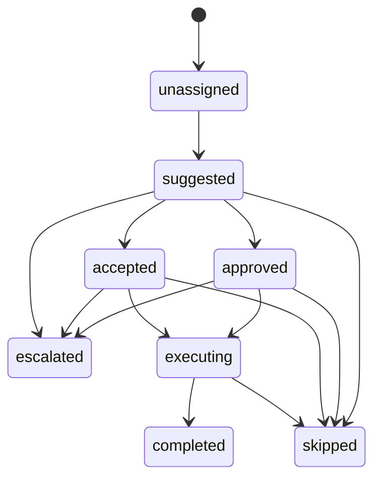

# AI 团队跟进编排器设计

## 1. 产品目标

Team Follow-up Orchestrator 的目标不是重新发明执行器，而是把当前已经可用的 `customer_pulse action cards` 升级成团队级“任务包 / 波次 / 转派建议 / 升级 / 接力”。

MVP 约束：

- 输入仍以现有 `customer_pulse` 为主，不另起一套信号系统。
- 输出新增 `mission`、`mission_item`、`assignment suggestion`、`escalation suggestion`、`batch draft suggestion`。
- 最终执行仍复用既有 4 类以上 `customer_pulse executor`，尤其保留“先生成草稿，再人工确认”的安全链路。
- tenant / RBAC / audit / evidence 边界全部复用现有 `customer_pulse` 能力，不平行造轮子。

## 2. 用户故事

### 2.1 销售

目标：

- 不是再看一堆零散 action card，而是直接看到“我今天该收下哪些任务包”。

典型故事：

- 作为销售，我进入“我的任务包”，看到系统按高优先级客户、草稿类客户、超期未跟进客户聚合出的任务包。
- 我可以接受某个任务包，或认领其中一组客户项。
- 如果系统建议将某些客户转派给我，我可以先看建议原因、证据和当前 owner，再决定是否接受。
- 如果涉及外发消息，我只能先预生成草稿，不能自动发送。

### 2.2 经理

目标：

- 看到团队负载、建议接力对象、风险升级项，做确认而不是人工翻卡片。

典型故事：

- 作为经理，我在“团队指挥台”看到 owner 维度的卡片压力、超期压力和草稿候选压力。
- 对于系统给出的转派建议，我可以发起审批或确认接力。
- 对于高风险客户，我可以把任务包升级为需要复核的 mission。

### 2.3 运营

目标：

- 关注“今天这批客户是否适合做统一波次处理”，尤其是批量草稿预生成和阻塞排查。

典型故事：

- 作为运营，我可以查看批量草稿建议，先预生成一波回复草稿，再让销售逐条确认。
- 我可以把“当前 owner 冲突、无下次跟进、证据不足”的客户项标记为阻塞或忽略。

## 3. 状态机

MVP 状态机：

- `unassigned`
- `suggested`
- `accepted`
- `approved`
- `executing`
- `completed`
- `skipped`
- `escalated`

状态定义：

- `unassigned`：系统已产出候选，但还没有明确接受人。
- `suggested`：系统已形成任务包 / 转派 / 升级建议，等待人确认。
- `accepted`：销售或经理已接受该任务包，准备执行。
- `approved`：涉及转派或经理审批的动作已通过确认。
- `executing`：正在拆分调用现有 `customer_pulse` executor。
- `completed`：对应的客户项已处理完成，且已有 writeback。
- `skipped`：用户显式跳过、忽略或标记不处理。
- `escalated`：被提升到经理或更高优先级处理路径。

### 3.1 状态流转

### 3.2 动作与状态对应

- 接受编排：`suggested -> accepted`
- 认领：`unassigned/suggested -> accepted`
- 转派建议：停留在 `suggested`，等待确认或审批
- 经理审批转派：`suggested -> approved`
- 批量草稿预生成：`accepted/approved -> executing`
- 升级：`suggested/accepted -> escalated`
- 标记阻塞：`accepted -> skipped`，并附阻塞原因
- 忽略：`suggested -> skipped`

## 4. 页面流

### 4.1 我的任务包

页面目标：

- 面向销售，只看与自己直接相关的任务包和客户项。

页面内容：

- 我的 mission 候选
- 我的 mission item
- 待我认领的转派建议
- 待我处理的批量草稿建议

入口：

- Admin 导航：`团队编排`
- 过滤器：`scope=mine`

### 4.2 团队指挥台

页面目标：

- 面向经理 / 运营，用于看 owner 负载、队列压力、升级建议和团队接力。

页面内容：

- owner workload
- mission candidates
- assignment suggestions
- escalation suggestions
- batch draft suggestions

入口：

- Admin 导航：`团队编排`
- 默认 `scope=team`

### 4.3 客户详情联动

页面目标：

- 在客户详情页快速跳转到编排器中当前客户的相关任务项。

MVP 方案：

- 客户详情页提供“查看团队编排”链接
- 链接带 `external_userid`
- 后端提供 `/api/admin/followup-orchestrator/customers/<external_userid>` 作为后续 widget 的最小数据口

本阶段不新增第二个复杂 widget，避免与现有 `AI 下一步` 重叠。

## 5. 异常流

### 5.1 无权限

- 页面路由直接复用 `customer_pulse` 的 page visible / inbox view 权限校验
- 没有页面权限时：
  - 页面显示 placeholder
  - API 返回 `403`

### 5.2 跨租户

- MVP 直接复用当前 request-scoped tenant context
- 如果 tenant 缺失、tenant 非法、owner scope 越界：
  - 由现有 `customer_pulse` access 直接拒绝
  - 不在 orchestrator 里新写第二套租户校验

### 5.3 owner 冲突

典型场景：

- 当前客户 owner 与建议接力人不同
- 当前 actor 不是可 view-all 的角色

处理：

- 只输出 suggestion
- 不直接 silent 改 owner
- 外部租户默认要求经理确认

### 5.4 审批失败

MVP 只提供审批动作骨架，不做完整审批引擎。

当前策略：

- API skeleton 预留 `request_manager_approval`
- 本阶段返回 `not_implemented`
- 真正审批流留到后续迭代，避免引爆边界

## 6. 核心实体与存储模型

命名原则：

- 贴合仓库已有风格，使用 domain 前缀命名
- 不改老表语义，尽量通过新表挂载新状态

### 6.1 `followup_orchestrator_policies`

用途：

- 保存编排层策略草稿和 tenant 级编排规则

关键字段：

- `tenant_key`
- `policy_key`
- `policy_type`
- `policy_scope`
- `payload_json`
- `created_by`

### 6.2 `followup_orchestrator_missions`

用途：

- 表示一个任务包 / 波次 / 团队级编排单元

关键字段：

- `tenant_key`
- `mission_key`
- `mission_type`
- `mission_status`
- `owner_userid`
- `team_scope_key`
- `source_type`
- `summary`
- `priority_score`
- `item_count`
- `requires_manager_approval`
- `payload_json`

### 6.3 `followup_orchestrator_mission_items`

用途：

- 表示 mission 内的具体客户项

关键字段：

- `tenant_key`
- `mission_id`
- `mission_item_key`
- `item_status`
- `assignment_status`
- `external_userid`
- `customer_name`
- `owner_userid`
- `suggested_assignee_userid`
- `pulse_card_id`
- `pulse_snapshot_id`
- `payload_json`
- `evidence_refs_json`

### 6.4 `followup_orchestrator_assignment_decisions`

用途：

- 表示转派建议、认领决定、审批决定

关键字段：

- `tenant_key`
- `mission_id`
- `mission_item_id`
- `decision_type`
- `decision_status`
- `current_owner_userid`
- `suggested_owner_userid`
- `decided_by_userid`
- `approved_by_userid`
- `payload_json`

### 6.5 `followup_orchestrator_mission_feedback`

用途：

- 沉淀“这个任务包是否有帮助、是否误判、是否被忽略”

关键字段：

- `tenant_key`
- `mission_id`
- `mission_item_id`
- `feedback_type`
- `feedback_source`
- `operator`
- `note`
- `payload_json`

### 6.6 `followup_orchestrator_execution_logs`

用途：

- 记录 mission 级别的执行计划与结果
- 不替代 `customer_pulse_execution_logs`，而是记录编排层调用关系

关键字段：

- `tenant_key`
- `mission_id`
- `mission_item_id`
- `action_type`
- `execution_status`
- `operator`
- `actor_userid`
- `actor_role`
- `resource_type`
- `resource_id`
- `tenant_context_json`
- `request_payload_json`
- `result_payload_json`
- `error_message`

## 7. 新表与老表字段的继承关系

### 7.1 直接继承现有表的字段

来自 `customer_pulse_cards`：

- `external_userid`
- `customer_name`
- `owner_userid`
- `priority_score`
- `risk_flags`
- `suggested_action_type`
- `evidence_refs`

来自 `customer_pulse_snapshots`：

- `pulse_snapshot_id`
- `signals`
- `ai_payload`

来自 request-scoped access：

- `tenant_key`
- `actor_userid`
- `actor_role`
- `auth_mode`

### 7.2 新表自己维护的字段

- `mission_status`
- `assignment_status`
- `decision_status`
- `requires_manager_approval`
- `team_scope_key`
- `mission_key / mission_item_key`

原则：

- 尽量少改老表
- 编排层状态写进新表
- 执行动作仍回落到原有 executor

## 8. 权限与租户复用策略

MVP 不新建平行权限体系，直接复用现有 `customer_pulse`：

- request context：`current_customer_pulse_request_access_context()`
- tenant 校验：`assert_customer_pulse_request_context(...)`
- 页面权限：`assert_customer_pulse_page_visible(...)`
- 列表查看：`assert_customer_pulse_inbox_view(...)`
- tenant summary：`customer_pulse_tenant_context_summary(...)`
- 模板 access payload：`customer_pulse_template_access_payload(...)`

结果：

- 本阶段 orchestrator 的页面和 API 可以直接继承当前 tenant / RBAC / evidence 边界。
- 后续再把页面级、动作级权限独立细化。

## 9. API 与页面骨架

本次落地的最小骨架：

- 页面：
  - `GET /admin/followup-orchestrator`
- API：
  - `GET /api/admin/followup-orchestrator`
  - `GET /api/admin/followup-orchestrator/customers/<external_userid>`
  - `POST /api/admin/followup-orchestrator/missions/<mission_key>/actions/<action_type>`

### 9.1 本阶段已实现

- feature flag `ai_followup_orchestrator`
- Admin 导航入口 `团队编排`
- 团队编排占位页
- 基于 `customer_pulse_cards` 的任务包候选聚合
- owner workload、assignment suggestion、escalation suggestion、batch draft suggestion 的只读输出
- 客户详情页跳转入口
- 最小数据库骨架

### 9.2 本阶段故意只留骨架

- 经理审批流仍是轻量状态流，不是完整审批中心
- 真正批量调用既有 `customer_pulse executor` 的 orchestration runner 仍待下一阶段
- AI 增强层只负责解释、handoff packet 与批量草稿建议，不负责自动执行

当前已经实现：

- mission / mission_item / assignment decision / execution log 持久化
- `accept / claim / complete / skip / mark_blocked / prebuild_batch_draft / escalate` 基础状态流
- internal API：团队任务板、我的任务包、mission 详情、mission action、sync

## 11. AI 增强层

AI 只叠加在 rule-based 编排结果之上，不替代规则引擎，也不自动执行动作。

AI 输出边界：

- 解释为什么建议这样编排
- 给 mission 起标题和摘要
- 生成 handoff packet
- 对 batchable mission 生成逐客户草稿建议
- 给经理生成转派/升级说明

AI 禁止事项：

- 自动改 owner
- 自动外发消息
- 自动越权查看 evidence
- 自动跨租户聚类

AI 输出 JSON：

- `missionTitle`
- `missionSummary`
- `assignmentWhy`
- `escalationWhy`
- `handoffSummary`
- `perItemDrafts[]`
- `confidence`
- `evidenceRefs`

运行策略：

- 每个 mission 和每个 item 都保留可追溯的 `evidenceRefs`
- 低置信度时只展示 rule-based mission，不展示 AI 批量草稿
- provider 失败、prompt injection、PII、越权 evidence、价格承诺或不合规输出时直接降级
- AI run / output 仍走现有 automation agent run / output 日志链路，便于追溯

## 10. 推荐实施顺序

### 10.1 第一段

- 上线只读团队编排页
- 先验证 owner workload、mission candidates、customer detail 联动是否合理

### 10.2 第二段

- 打通 `accept / claim / complete / skip / mark_blocked`
- 把状态真正写入 `followup_orchestrator_missions` 和 `mission_items`

### 10.3 第三段

- 接入 `request_manager_approval`
- 用 mission execution log 串联 `customer_pulse_execution_logs`
- 打通真正的批量草稿预生成与 team-level writeback
