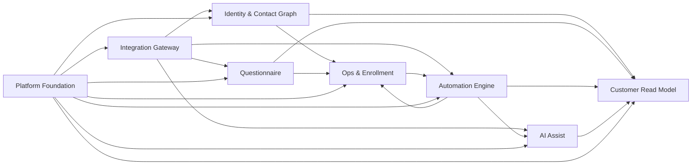

# AI-CRM 全局重构蓝图 V1

日期：2026-04-17

状态：Proposed

基线说明：

- 本仓库只保留这一份有效的《AI-CRM 全局重构蓝图 V1》
- 若后续出现其他 V1 同主题副本，应视为 `OBSOLETE` 并移动到 `archive/` 或在文件头显式标注失效

适用范围：

- `wecom_ability_service/`
- `openclaw_service/`
- `wecom_ability_service/schema.sql`
- `wecom_ability_service/schema_postgres.sql`

## 1. 这份文档解决什么问题

这不是一份“技术清理备忘录”，而是一份面向后续 2-4 个迭代的产品级重构蓝图。

当前仓库已经不是单一 CRM，而是一个运行在单体 Flask 服务里的复合业务平台，至少同时包含：

- 企微联系人 / 群聊 / 标签 / 回调 / 会话存档能力
- CRM 客户中心与客户时间线读模型
- 用户运营与 lead pool / class user
- 问卷、公众号 OAuth、问卷外发
- 自动化转化与 workflow / SOP / agent 配置
- AI Customer Pulse
- Followup Orchestrator
- OpenClaw / MCP / CRM HTTP 适配层

本次重构的目标不是立刻拆成微服务，而是把当前“可运行但边界模糊”的单体，重构成可持续演进的模块化单体。

## 2. 当前状态结论

### 2.1 运行形态

当前系统仍是单体部署：

- Flask 单应用入口：[app.py](../../app.py)
- App 装配入口：[wecom_ability_service/__init__.py](../../wecom_ability_service/__init__.py)
- HTTP 路由注册入口：[wecom_ability_service/http/__init__.py](../../wecom_ability_service/http/__init__.py)
- MCP 入口：[wecom_ability_service/mcp_adapter.py](../../wecom_ability_service/mcp_adapter.py)
- 线上 systemd 服务：[deploy/openclaw-wecom-postgres.service](../../deploy/openclaw-wecom-postgres.service)

结论：

- 当前不具备“按服务独立部署”的现实基础
- 但已经具备“按业务上下文重构成模块化单体”的现实基础

### 2.2 结构性现状

当前仓库同时存在三条正在演进中的主线：

1. 身份主线  
   从 `external_userid` 直接驱动，逐步迁移到 `person_id` 作为内部主锚点

2. 隔离主线  
   从全局共享模型，逐步演进到 `tenant_key` + policy 控制的请求级隔离

3. 自动化主线  
   从规则型营销自动化，逐步演进到 agent / workflow / AI 协同自动化

当前问题不是“没有架构”，而是三条线都只推进了一半，导致系统在概念上分层了，但在代码和数据归属上还没有真正收口。

### 2.3 可量化证据

当前基线有几个非常明确的结构信号：

- `schema.sql` 已经包含约 100+ 张表
- 其中 `automation_*` 36 张，`user_ops*` 11 张，`questionnaire*` 8 张，`customer_pulse*` 8 张，`followup_orchestrator*` 6 张
- `domains/` 目录下存在多个超大文件：
  - [wecom_ability_service/domains/customer_pulse/service.py](../../wecom_ability_service/domains/customer_pulse/service.py)
  - [wecom_ability_service/domains/automation_conversion/orchestration_service.py](../../wecom_ability_service/domains/automation_conversion/orchestration_service.py)
  - [wecom_ability_service/domains/user_ops/service.py](../../wecom_ability_service/domains/user_ops/service.py)
  - [wecom_ability_service/domains/automation_conversion/service.py](../../wecom_ability_service/domains/automation_conversion/service.py)
  - [wecom_ability_service/domains/marketing_automation/service.py](../../wecom_ability_service/domains/marketing_automation/service.py)
- 多个 domain service 仍直接依赖：
  - `current_app`
  - `session`
  - `request`
  - `requests`
  - 其他上下文域 service / repo / http runtime

结论：

- 现状已经超出“按文件继续拆拆就好”的阶段
- 必须回到产品边界、上下文边界和数据所有权重新分层

## 3. 重构总原则

### 3.1 先做模块化单体，不做服务化拆分

原因：

- 当前线上只有一个稳定部署单元
- 当前多个上下文共享同一数据库与同一事务边界
- 现阶段最大风险来自边界模糊，不来自部署瓶颈

因此 V1 目标是：

- 保留单体部署
- 明确上下文边界
- 统一数据所有权
- 通过 application API 取代跨域直接互调
- 为后续必要的服务化拆分预留出口

### 3.2 明确四层模型

后续统一按四层思路组织：

1. `integration gateway`
   - 第三方输入输出适配
   - WeCom / WeChat / OpenClaw / Webhook / Message Activity

2. `core domains`
   - 领域事实、规则、状态机
   - 不直接依赖 Flask response / session / request

3. `read models and projections`
   - customer center / timeline / dashboard / inbox / mission board
   - 面向页面、MCP、bot 的聚合读模型

4. `platform foundation`
   - settings / auth / policy / audit / observability / scheduler / idempotency

### 3.3 主数据和投影数据强制分离

后续严格区分：

- 事实源表
- 身份关系表
- 投影状态表
- 执行日志 / 审计表

任何新的业务判断结果不得直接回写事实源表。

## 4. 目标上下文图

### 目标上下文说明

#### 1. Integration Gateway

职责：

- 企微联系人 / 标签 / 群聊 / 回调 / 会话存档适配
- 微信 OAuth 适配
- OpenClaw CRM HTTP / MCP 适配
- 外部 Webhook 下发
- 外部消息活跃度数据读取

边界要求：

- 不保存业务判断
- 只做协议转换、认证、重试、幂等、防抖
- 不在 controller 里直接打第三方 API

#### 2. Identity & Contact Graph

职责：

- `people`
- `external_contact_bindings`
- `wecom_external_contact_identity_map`
- `wecom_external_contact_follow_users`
- `contacts`

边界要求：

- 统一“人”和“企微客户关系”的内部主锚点
- 统一身份解析入口
- 统一跟进关系和 owner 解析

#### 3. Customer Read Model

职责：

- customer center
- customer timeline
- admin customer profile
- OpenClaw 读取契约

边界要求：

- 只读聚合
- 不拥有事实写入
- 对外暴露稳定读契约

#### 4. Ops & Enrollment

职责：

- user ops
- lead pool
- class user
- owner routing
- class term / tag 映射

边界要求：

- 维护运营池和报名状态
- 不直接承担 AI 编排

#### 5. Questionnaire

职责：

- 问卷配置
- 公开问卷页
- OAuth 身份回填
- 问卷提交
- SCRM apply
- 外发 webhook

边界要求：

- 问卷域只负责问卷事实与提交结果
- 不直接拥有客户营销分层总状态

#### 6. Automation Engine

职责：

- 转化自动化
- workflow / audience / node / execution
- SOP
- agent prompt / run / output / export
- 自动化成员 `automation_member`

边界要求：

- 这是“自动化执行平台”
- 不直接代替 CRM 主身份模型

#### 7. AI Assist

职责：

- customer pulse
- followup orchestrator
- AI recommendation / mission assignment / action execution

边界要求：

- 只消费身份、事件、状态和读模型
- 不直接拥有底层联系人事实

#### 8. Platform Foundation

职责：

- `app_settings`
- internal auth
- access policy
- idempotency / audit / execution log
- observability
- job scheduling / due runner / retry

边界要求：

- 提供共享基础设施
- 不承载业务语义

## 5. 核心 ADR 决策

### ADR-001：保留模块化单体，暂不拆微服务

#### Status

Accepted for V1

#### Context

系统当前共用：

- 单应用入口
- 单数据库
- 单线上部署单元
- 大量同步调用和跨域 SQL 读写

#### Decision

V1 保留单体部署，只做模块化单体重构。

#### Consequences

Positive:

- 降低迁移风险
- 避免先为部署拆分付出过高治理成本
- 允许先清理边界和数据归属

Negative:

- 运行时隔离仍然有限
- 需要更强的代码边界约束来代替部署边界

### ADR-002：`person_id` 是内部唯一主锚点，`external_userid` 是外部联系点

#### Status

Accepted for V1

#### Context

当前不少状态表仍以 `external_userid` 作为主识别键，但系统已经存在：

- `people`
- `external_contact_bindings`

说明内部主身份模型已经开始形成。

#### Decision

后续统一规定：

- 内部主身份以 `people.id = person_id` 为准
- `external_userid` 视为“企微外部联系点”
- 新的状态 / 投影 / 执行类表优先同时保留 `person_id` 与 `external_userid`
- 逐步让核心内部状态从 `external_userid unique` 迁到 `person_id unique`

#### Consequences

Positive:

- 可以承接一个人多个接触点或后续更多渠道
- 解决身份绑定和业务状态直接耦合的问题

Negative:

- 迁移成本高
- 需要补更多回填脚本与一致性校验

### ADR-003：采用“双层隔离模型”，不强行把所有表都改成 tenant-first

#### Status

Accepted for V1

#### Context

现有隔离实际上有三种粒度：

- `corp_id`：企微原始数据域
- `owner_userid` / role：业务操作和团队关系
- `tenant_key`：AI 子系统请求级隔离

如果简单把所有核心表都加 `tenant_key`，会制造伪隔离，且迁移成本极高。

#### Decision

采用双层隔离模型：

1. 原始接入层和身份层  
   使用 `corp_id` + `owner_userid` 作为源数据边界

2. AI / 编排 / 工作台层  
   使用 `tenant_key` 作为工作空间边界

同时定义：

- `tenant_key` 是产品工作空间，不是第三方原始租户
- `Customer Read Model` 必须支持按 `tenant_key` + policy 输出受限视图

#### Consequences

Positive:

- 与现有数据模型兼容
- 能解释当前 `customer_pulse` / `followup_orchestrator` 的 tenant 化设计
- 避免对原始事实表做无意义的全量 tenant 改造

Negative:

- 需要额外维护“源数据域”和“工作空间域”的映射逻辑

### ADR-004：Customer Center / Timeline 是读模型，不是业务域

#### Status

Accepted for V1

#### Context

当前 customer_center / timeline 已经跨多表、跨多域聚合，但仍有部分业务域直接反向依赖它们。

#### Decision

后续明确：

- `customer_center` / `customer_timeline` 归属 `Customer Read Model`
- 任何业务域不得把它们当作写模型
- 业务域只写事实和状态
- 读模型统一从 source + projection 生成

#### Consequences

Positive:

- 明确读写分工
- 对 OpenClaw / MCP / 后台页面更稳定

Negative:

- 需要新增 application service 层来替代直接跨域拼装

### ADR-005：所有外部接入统一收敛到 Integration Gateway

#### Status

Accepted for V1

#### Context

当前外部调用散落在：

- domain service
- controller
- infra helper

且有部分 domain service 直接 `requests.post()`。

#### Decision

外部调用逐步收敛：

- HTTP third-party client
- webhook client
- OAuth client
- WeCom runtime client
- OpenClaw adapter

业务域只通过 gateway / runtime port 调用。

#### Consequences

Positive:

- 便于测试、重试、熔断和审计
- 降低业务代码对第三方协议细节的耦合

Negative:

- 前期需要补一层 adapter / port 接口

## 6. 现有表到新上下文的归属

本节只定义“归属”，不表示所有表都要立即迁移目录或 SQL 文件。

### 6.1 Identity & Contact Graph

拥有的核心表：

- `people`
- `external_contact_bindings`
- `contacts`
- `wecom_external_contact_identity_map`
- `wecom_external_contact_follow_users`
- `group_chats`
- `contact_tags`

说明：

- `contacts` 仍是企微联系人快照，不是统一客户主表
- `contact_tags` 更像企微标签快照，应保留在 contact graph
- `group_chats` 作为企微客户群目录，也归入 contact graph

### 6.2 Customer Read Model

拥有的聚合对象：

- `/api/customers`
- `/api/customers/<external_userid>`
- `/api/customers/<external_userid>/timeline`
- admin customer profile 聚合视图
- OpenClaw customer context 读取契约

直接消费的上游表：

- `contacts`
- `external_contact_bindings`
- `wecom_external_contact_identity_map`
- `wecom_external_contact_follow_users`
- `contact_tags`
- `class_user_status_current`
- `archived_messages`
- `questionnaire_submissions`
- `wecom_external_contact_event_logs`
- `customer_marketing_state_current`
- `customer_marketing_state_history`
- `customer_value_segment_current`
- `customer_value_segment_history`
- `conversion_dispatch_log`
- `customer_pulse_activity_logs`

说明：

- 读模型本身尽量不新增“真业务主表”
- 必要时可以新增 projection cache，但所有权仍属于 read model

### 6.3 Ops & Enrollment

拥有的核心表：

- `owner_role_map`
- `signup_tag_rules`
- `routing_rule_config`
- `class_user_status_current`
- `class_user_status_history`
- `class_term_tag_mapping`
- `user_ops_pool_current`
- `user_ops_pool_history`
- `user_ops_lead_pool_current`
- `user_ops_lead_pool_history`
- `user_ops_experience_leads`
- `user_ops_import_batches`
- `user_ops_activation_status_source`
- `user_ops_huangxiaocan_activation_source`
- `user_ops_do_not_disturb`
- `user_ops_send_records`
- `user_ops_deferred_jobs`

说明：

- 这一上下文负责“运营池、班期、报名、免打扰、发送记录”
- 不负责 AI 行为推荐和编排

### 6.4 Questionnaire

拥有的核心表：

- `questionnaires`
- `questionnaire_questions`
- `questionnaire_options`
- `questionnaire_score_rules`
- `questionnaire_submissions`
- `questionnaire_submission_answers`
- `questionnaire_scrm_apply_logs`
- `questionnaire_external_push_logs`

说明：

- 问卷域只负责配置、提交、外发、SCRM 应用结果
- 问卷提交衍生出的营销分层不归它自己所有

### 6.5 Automation Engine

拥有的核心表：

- `message_batches`
- `message_batch_items`
- `conversion_feedback`
- `conversion_dispatch_log`
- `marketing_state_current`
- `marketing_value_segment_current`
- `marketing_automation_configs`
- `marketing_automation_question_rules`
- `customer_marketing_state_current`
- `customer_marketing_state_history`
- `customer_value_segment_current`
- `customer_value_segment_history`
- `outbound_tasks`
- `outbound_webhook_deliveries`
- `automation_channel`
- `automation_member`
- `automation_event`
- `automation_ai_push_log`
- `automation_message_activity_sync_run`
- `automation_message_activity_sync_item`
- `automation_reply_monitor_config`
- `automation_reply_monitor_queue`
- `automation_focus_send_batch`
- `automation_focus_send_batch_item`
- `automation_sop_pool_config`
- `automation_sop_template`
- `automation_sop_progress`
- `automation_sop_batch`
- `automation_sop_batch_item`
- `automation_agent_prompt_registry`
- `automation_agent_llm_call_log`
- `automation_agent_router_config`
- `automation_agent_config`
- `automation_agent_skill_registry`
- `automation_agent_run`
- `automation_agent_output`
- `automation_agent_output_export_job`
- `automation_agent_skill_call_audit`
- `automation_profile_segment_template`
- `automation_profile_segment_category`
- `automation_profile_segment_option_mapping`
- `automation_workflow`
- `automation_workflow_audience`
- `automation_member_audience_entry`
- `automation_workflow_agent_binding`
- `automation_workflow_node`
- `automation_workflow_node_content`
- `automation_workflow_node_content_variant`
- `automation_workflow_execution`
- `automation_workflow_execution_item`

说明：

- 这是当前最重的上下文
- 需要拆成至少 4 个子模块：
  - audience/member
  - workflow/runtime
  - messaging dispatch
  - agent runtime/config

### 6.6 AI Assist

拥有的核心表：

- `customer_pulse_signal_events`
- `customer_pulse_snapshots`
- `customer_pulse_cards`
- `customer_pulse_feedback_logs`
- `customer_pulse_execution_logs`
- `customer_pulse_activity_logs`
- `customer_pulse_action_feedback`
- `customer_pulse_metric_events`
- `followup_orchestrator_policies`
- `followup_orchestrator_missions`
- `followup_orchestrator_mission_items`
- `followup_orchestrator_assignment_decisions`
- `followup_orchestrator_mission_feedback`
- `followup_orchestrator_execution_logs`

说明：

- 这是“AI 协作和人机共驾工作台”
- 它消费 read model 和 automation 状态，不应该反向拥有联系人基础事实

### 6.7 Integration Gateway / Platform Foundation

拥有或主导的表：

- `sync_runs`
- `archive_sync_state`
- `admin_operation_logs`
- `app_settings`
- `mcp_tool_settings`

说明：

- 这些表更多是平台和接入运行态，不属于具体业务上下文

## 7. 身份模型重构口径

### 7.1 目标身份模型

统一定义：

- `person_id`：内部唯一主身份
- `external_userid`：企微客户关系标识
- `corp_id`：第三方源系统标识
- `owner_userid`：当前或历史业务负责人

### 7.2 目标规则

后续所有新表按以下规则：

1. 只要这个状态是“人的状态”，优先带 `person_id`
2. 只要这个状态与企微接触点强相关，同时保留 `external_userid`
3. 原始源数据表保留 `corp_id`
4. 读模型负责把 `person_id` / `external_userid` / `owner_userid` 聚合成统一客户视图

### 7.3 不立即做的事

V1 不建议立即：

- 删除 `external_userid` 作为查询入口
- 强制所有老表加 `person_id`
- 直接重做 identity schema

V1 的重点是：

- 新状态表优先 person-first
- 旧状态表补 person 回填通路
- 在 application service 里统一解析

## 8. 数据隔离重构口径

### 8.1 统一口径

后续统一采用三层概念：

1. `corp_id`
   - 第三方原始来源边界

2. `tenant_key`
   - 产品工作空间边界
   - 面向 AI、工作台、编排、任务协同

3. `owner_userid` / role / policy
   - 业务责任边界
   - 面向运营、销售、交付、管理员

### 8.2 具体策略

#### 原始事实表

不强求全部 tenant 化：

- `archived_messages`
- `contacts`
- `wecom_external_contact_identity_map`
- `wecom_external_contact_follow_users`
- `wecom_external_contact_event_logs`

这些表仍属于源事实层。

#### 衍生状态表

要求具备明确隔离策略：

- AI / orchestrator / pulse / mission 表保留 `tenant_key`
- 运营池和发送记录优先按 policy 输出受限视图
- 如需真正工作空间归属，再在 projection / workspace mapping 层引入 `tenant_key`

#### 读模型层

`Customer Read Model` 必须支持：

- 全局视图
- owner 受限视图
- tenant 受限视图

但不要把隔离策略散落在每个 controller 和 domain service 里。

### 8.3 需要新增的基础能力

建议新增：

- `scope_resolver`：解析当前请求 scope
- `customer_scope_policy`：统一 customer 可见性判断
- `tenant_mapping`：定义 tenant 和 owner/team 的关系

## 9. 产品底座重构口径

后续“产品底座”定义为以下 8 项能力：

1. 配置与密钥管理
2. 内部鉴权与动作令牌
3. 请求级 scope / policy
4. 第三方网关与重试
5. 调度 / due runner / retry runner
6. 审计 / 幂等 / 执行日志
7. 统一可观测性
8. 稳定读契约与 adapter 边界

### 9.1 当前已有底座

已有基础：

- [wecom_ability_service/infra/settings.py](../../wecom_ability_service/infra/settings.py)
- [wecom_ability_service/http/internal_auth.py](../../wecom_ability_service/http/internal_auth.py)
- [wecom_ability_service/infra/wecom_runtime.py](../../wecom_ability_service/infra/wecom_runtime.py)
- [wecom_ability_service/infra/wechat_oauth.py](../../wecom_ability_service/infra/wechat_oauth.py)
- `admin_operation_logs`
- `outbound_webhook_deliveries`
- 各类 execution log / feedback log / audit log

### 9.2 当前底座缺口

主要缺口：

- domain service 还直接依赖 Flask context
- domain service 还直接打第三方 HTTP
- 统一的 application API 边界还不完整
- scope / policy 未成为平台层能力
- 读模型 contract 和写模型 command boundary 尚未彻底分离

## 10. API 保持兼容的迁移顺序

原则：

- 对外 path 不变
- 对外 JSON 核心字段不变
- 先做内部迁移，再考虑新增内部 API

### Phase 0：冻结外部契约

冻结以下契约，不允许随意改 path / 核心字段：

- `/api/customers`
- `/api/customers/<external_userid>`
- `/api/customers/<external_userid>/timeline`
- `/api/identity/resolve`
- `/api/messages/<external_userid>`
- `/api/messages/<external_userid>/recent`
- `/api/messages/search`
- `/api/h5/questionnaires/<slug>`
- `/api/h5/questionnaires/<slug>/submit`
- `/mcp`

同时维护：

- [docs/crm_route_inventory.md](../crm_route_inventory.md)
- [docs/openclaw_crm_read_contract.md](../openclaw_crm_read_contract.md)

### Phase 1：先抽 application service，不改接口

做法：

- 保持现有 controller 不动 path
- controller 只调用新的 application service
- application service 再调用所属上下文的 domain service / query service

目标：

- 消除 controller 直接拼装
- 消除跨域 service 直接互相调用

### Phase 2：统一 Customer Read Model 出口

做法：

- customer center / timeline 统一挂到 read model application service
- OpenClaw / MCP / admin customer profile 全部改走 read model application API

目标：

- 避免多个调用方重复拼 contacts + binding + class user + pulse + marketing

### Phase 3：收敛写操作入口

做法：

- 身份绑定只走 identity application service
- 标签写入只走 tag command service
- 发送任务只走 messaging command service
- 问卷提交只走 questionnaire submit service
- 自动化成员状态只走 automation member application service

目标：

- 同类写操作只有一个正式入口

### Phase 4：拆 AI / Automation 内部边界

做法：

- Pulse 只读 read model + automation projection
- Orchestrator 只读 pulse/read model，并把执行动作走 command bus
- Agent runtime 只从 automation engine 暴露能力，不反向侵入 CRM 域

目标：

- 把 AI 层变成“消费层”，而不是新的主业务层

## 11. Wave 2 及之后候选的大模块拆分

说明：

- 本节只保留 Wave 2 及之后的模块级拆分候选
- 不包含 Wave 1 入口收口内容
- Wave 1 入口收口见执行顺序章节，不在本节展开

### 11.1 优先拆分候选

#### 1. [wecom_ability_service/domains/user_ops/service.py](../../wecom_ability_service/domains/user_ops/service.py)

原因：

- 同时承担运营池构建、班期回填、导入解析、第三方激活同步、sidebar 绑定后补偿
- 单文件职责过宽
- 与 identity / tags / lead pool / import 交叉严重

建议拆成：

- `user_ops_pool_service.py`
- `user_ops_import_service.py`
- `user_ops_class_term_service.py`
- `user_ops_sidebar_service.py`
- `user_ops_deferred_job_service.py`

#### 2. [wecom_ability_service/domains/questionnaire/service.py](../../wecom_ability_service/domains/questionnaire/service.py)

原因：

- 同时承担问卷配置、公开读取、提交校验、身份解析、SCRM 应用、外发 webhook
- 已经是一个完整子系统，不应再挤在一个 service 文件里

建议拆成：

- `questionnaire_admin_service.py`
- `questionnaire_public_service.py`
- `questionnaire_submit_service.py`
- `questionnaire_external_push_service.py`
- `questionnaire_identity_service.py`

#### 3. [wecom_ability_service/domains/automation_conversion/service.py](../../wecom_ability_service/domains/automation_conversion/service.py)

原因：

- 同时承担渠道、成员、SOP、focus send、设置页、overview、callback 后续同步
- 已经远超单一 domain service 的合理体量

建议拆成：

- `automation_member_service.py`
- `automation_channel_service.py`
- `automation_sop_service.py`
- `automation_reply_monitor_service.py`
- `automation_settings_service.py`

#### 4. [wecom_ability_service/domains/automation_conversion/orchestration_service.py](../../wecom_ability_service/domains/automation_conversion/orchestration_service.py)

原因：

- 本质是 workflow runtime / router / execution 编排层
- 和 `automation_conversion/service.py` 混在同一上下文里会持续膨胀

建议拆成：

- `workflow_runtime_service.py`
- `workflow_execution_service.py`
- `router_dispatch_service.py`
- `workflow_read_service.py`

#### 5. [wecom_ability_service/domains/customer_pulse/service.py](../../wecom_ability_service/domains/customer_pulse/service.py)

原因：

- 同时承担 feature gate、signal build、snapshot materialize、card read、action preview、action execute、undo、feedback、dashboard
- 已经具备完整子平台特征

建议拆成：

- `customer_pulse_gate_service.py`
- `customer_pulse_signal_service.py`
- `customer_pulse_snapshot_service.py`
- `customer_pulse_inbox_service.py`
- `customer_pulse_action_service.py`
- `customer_pulse_metrics_service.py`

#### 6. [wecom_ability_service/domains/followup_orchestrator/service.py](../../wecom_ability_service/domains/followup_orchestrator/service.py)

原因：

- 同时承担任务生成、任务分配、团队看板、执行动作、undo
- 与 customer pulse 强耦合

建议拆成：

- `mission_sync_service.py`
- `mission_assignment_service.py`
- `mission_board_service.py`
- `mission_action_service.py`

## 12. 需要补的测试护栏清单

### 12.1 契约测试

必须新增或强化：

1. `identity resolution contract`
   - `person_id` / `external_userid` / `mobile` / `unionid` 解析优先级

2. `customer read model contract`
   - `/api/customers` 返回字段和筛选行为
   - `/api/customers/<external_userid>` 聚合字段稳定性

3. `timeline projection contract`
   - 不同 source table 事件类型和字段最小集稳定

4. `mcp tool contract`
   - tool name、输入、输出、错误行为稳定

5. `questionnaire submit contract`
   - OAuth / session identity / openid / unionid / external_userid 回填行为稳定

### 12.2 边界测试

建议新增以下测试文件：

- `tests/test_identity_application_contract.py`
- `tests/test_customer_read_model_contract.py`
- `tests/test_customer_scope_policy.py`
- `tests/test_questionnaire_identity_resolution.py`
- `tests/test_automation_member_sync_contract.py`
- `tests/test_customer_pulse_scope_contract.py`
- `tests/test_followup_orchestrator_scope_contract.py`
- `tests/test_integration_gateway_ports.py`

### 12.3 架构测试

现有已有一部分治理测试，后续需要再补硬约束：

1. controller 不允许直接打 `requests`
2. controller 不允许直接执行 SQL
3. domain 不允许 import Flask request / response / session
4. domain 不允许 import `http.*`
5. 读模型不允许承接业务写入
6. `services.py` 不允许新增业务实现

### 12.4 数据迁移测试

必须新增的回归用例：

1. `person_id` 回填不串人
2. `external_userid` 解绑 / 重绑后 customer center 不错配
3. `tenant_key` 缺省时 old behavior 不回归
4. `customer_marketing_state_current` person-first 迁移不丢状态
5. `questionnaire_submissions` 身份追溯不重复建记录

## 13. 建议的重构执行顺序

执行顺序说明：

- 先做入口收口，再做大模块拆分
- 第 11.1 节中的大模块拆分全部顺延到 Wave 2 及之后
- Wave 1 不进入 `user_ops` / `questionnaire` / `automation_conversion` / `customer_pulse` / `followup_orchestrator` 的模块内部分裂

### Wave 1：边界收口

目标：

- 不新增功能
- 只做 application API 抽象和超级入口收口

Wave 1 必须先收口的超级入口：

#### 1. [wecom_ability_service/mcp_adapter.py](../../wecom_ability_service/mcp_adapter.py)

原因：

- 当前是典型超级入口
- 直接引用 customer center、timeline、services、automation_conversion 多个能力

目标：

- 只保留 JSON-RPC transport
- 具体工具调用转到独立 tool application service

#### 2. [wecom_ability_service/services.py](../../wecom_ability_service/services.py)

原因：

- 目前还是历史兼容外观层
- 继续把新逻辑塞进去会再次形成巨型 facade

目标：

- 保留兼容导出
- 停止新增业务实现
- 逐步改成显式 re-export 和 shim

#### 3. [wecom_ability_service/customer_center/service.py](../../wecom_ability_service/customer_center/service.py)

原因：

- 当前已经是跨 contacts / binding / identity / class user / marketing / pulse 的聚合总线

目标：

- 不直接依赖 legacy `services.py`
- 抽为 read model application layer

#### 4. [wecom_ability_service/customer_timeline/service.py](../../wecom_ability_service/customer_timeline/service.py)

原因：

- 当前承担统一事件拼接
- 需要被明确定位为 projection assembler，而非业务域

目标：

- 拆成 event source collector + timeline assembler

范围：

- `customer_center`
- `customer_timeline`
- `services.py`
- `mcp_adapter.py`
- `http/*` controllers

交付标准：

- controller 全部只调 application service
- OpenClaw / MCP / admin customer profile 全走统一 read model application API

### Wave 2：身份与运营口径收口

目标：

- 固化 `person_id` 规则
- 固化 user_ops / class_user / routing 所有权

范围：

- `domains/identity`
- `domains/user_ops`
- `domains/class_user`
- `domains/routing_config`

交付标准：

- 身份解析只有一个正式入口
- user ops 和 class user 的写口统一

### Wave 3：问卷域独立

目标：

- 把 questionnaire 从“长 service”整理为完整上下文

范围：

- `domains/questionnaire`
- `http/public_questionnaires.py`
- `http/admin_questionnaires.py`
- `questionnaire_support.py`

交付标准：

- admin / public / submit / external push 四条线清晰

### Wave 4：自动化引擎收口

目标：

- 拆分 automation engine 内部子模块

范围：

- `domains/marketing_automation`
- `domains/automation_conversion`
- `domains/tasks`
- `domains/outbound_webhook`

交付标准：

- message dispatch、member state、workflow runtime、agent runtime 分层明确

### Wave 5：AI Assist 收口

目标：

- 把 pulse 和 orchestrator 变成真正消费层

范围：

- `domains/customer_pulse`
- `domains/followup_orchestrator`

交付标准：

- AI 层不再直接越过 application boundary 读取底层表

## 14. V1 完成后的目标状态

V1 完成后，系统应达到以下状态：

- 仍是单体部署
- 但具备清晰的上下文边界
- 身份、读模型、运营、问卷、自动化、AI 协同各自有明确所有权
- 第三方接入都走 gateway / runtime 端口
- `person_id` 成为内部主锚点
- `tenant_key` 成为工作空间级隔离能力，而不是散落在局部功能中的特殊字段
- customer center / timeline 成为正式读模型层
- OpenClaw / MCP 只依赖稳定契约，不反向依赖内部实现细节

## 15. 本文建议的下一步落地物

建议下一轮直接输出三份配套文档：

1. `context-boundary-map.md`
   - 逐目录定义 owner、allowed imports、forbidden imports

2. `phase-1-execution-plan.md`
   - 第一阶段改哪些文件、先后顺序、每步完成标准

3. `migration-guardrails-checklist.md`
   - 每波次必须跑的测试、SQL 校验、人工验收点

---

这份蓝图的结论是：

当前系统最适合的路径不是“继续在单体里补功能”，也不是“立刻拆服务”，而是先把它收敛成一个边界清晰、身份统一、隔离口径明确、读写分层明确的模块化单体平台。
