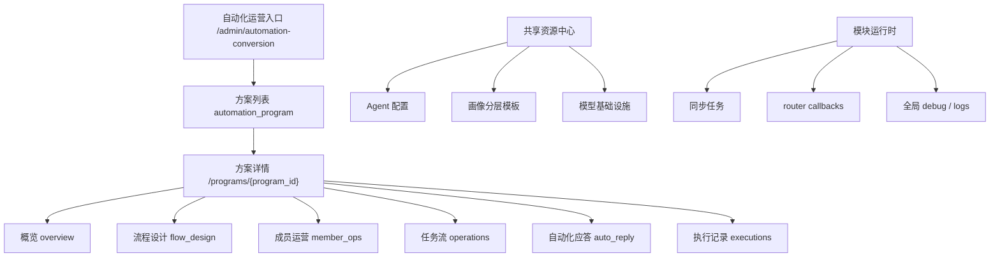

# 自动化运营方案 RFC

## 1. 背景

当前后台一级导航已收缩为“自动化运营、问卷、配置、API 文档”。其中“自动化运营”在产品上仍表现为一个一级模块，但从当前代码看，它已经不是单页能力，而是一个单例自动化运营系统：

- 页面入口集中在 `wecom_ability_service/http/automation_conversion.py`
- 领域能力集中在 `wecom_ability_service/domains/automation_conversion/`
- 数据表覆盖成员池、渠道、SOP、任务流、节点、执行、Agent、自动接话、模型配置、运行日志等
- 当前所有状态基本默认落在一个全局单例上，例如 `signup_conversion_v1`、`default`、全局 `automation_member` 唯一外部联系人

业务目标是在这个单例模块上新增顶层对象：

- 中文名：自动化运营方案
- 内部名：`automation_program`

点进“自动化运营”后，先进入“自动化运营方案列表”。业务方可以创建多个方案；进入某个方案后，再复用当前已有的方案内工作面。

本 RFC 只做顶层结构、边界、数据模型与迁移策略设计，不开始实现代码。

## 2. 当前自动化运营真实边界

### 2.1 当前页面与路由边界

当前后台页面入口：

- `/admin/automation-conversion`：方案列表
- `/admin/automation-conversion/programs/<program_id>/overview`：方案数据概览
- `/admin/automation-conversion/programs/<program_id>/operations`：方案运营编排
- `/admin/automation-conversion/programs/<program_id>/operations/workflows/new`：新建任务流
- `/admin/automation-conversion/programs/<program_id>/operations/workflows/<workflow_id>/edit`：编辑任务流
- `/admin/automation-conversion/programs/<program_id>/operations/workflows/<workflow_id>/nodes`：节点配置
- `/admin/automation-conversion/programs/<program_id>/executions`：执行记录
- `/admin/automation-conversion/auto-reply`：自动化应答
- `/admin/automation-conversion/shared/agents`：模型 / Agent 配置
- `/admin/automation-conversion/programs/<program_id>/flow-design`：流程设计，包含阶段模型、问卷规则、SOP、全局规则、默认渠道、发布
- `/admin/automation-conversion/programs/<program_id>/member-ops`：成员运营
- `/admin/automation-conversion/runtime`：运行中心，包含运行概况、同步、日志、模型基础设施、Agent Orchestration、调试

当前 API 入口包括：

- 成员动作：`/api/admin/automation-conversion/member/*`
- 阶段手动发送：`/api/admin/automation-conversion/stage/<stage_key>/*`
- SOP：`/api/admin/automation-conversion/sop/*`
- Dashboard / settings：`/api/admin/automation-conversion/dashboard`、`/api/admin/automation-conversion/settings`
- Agent / LLM / Review：`/api/admin/automation-conversion/agents*`、`agent-outputs*`、`review-outputs*`
- 画像分层模板：`/api/admin/automation-conversion/profile-segment-templates*`
- Workflow / node / execution：`/api/admin/automation-conversion/workflows*`、`workflow-nodes*`、`executions*`
- Reply monitor / router / jobs：`reply-monitor/*`、`router-*`、`jobs/run-due`

### 2.2 当前内部工作面

当前 `automation_conversion.py` 定义的一级工作区 tabs 只有：

- `overview`
- `operations`
- `auto_reply`
- `agent_config`

但实际还存在模块级入口和子工作面：

- `flow_design`：阶段模型、入池与问卷规则、SOP 剧本、全局规则、渠道、发布
- `member_ops`：成员列表、阶段详情、批量/手动触达
- `run_center`：运行概况、同步、日志、模型基础设施、Agent Orchestration、调试
- `workflow / node / execution`：任务流、节点、执行批次、执行项

因此新增 `automation_program` 时，不应简单把当前所有页面平铺到方案下，而应先把“方案内设计/运营”和“共享资源/运行时能力”拆开。

### 2.3 当前核心数据表边界

当前自动化运营相关表大致分为：

- 配置：`marketing_automation_configs`、`marketing_automation_question_rules`
- 旧状态：`marketing_state_current`、`marketing_value_segment_current`
- 客户状态：`customer_marketing_state_current`、`customer_marketing_state_history`
- 派发日志：`conversion_dispatch_log`
- 渠道与成员：`automation_channel`、`automation_member`、`automation_event`、`automation_ai_push_log`
- 同步与自动接话：`automation_message_activity_sync_*`、`automation_reply_monitor_*`
- Agent：`automation_agent_*`
- 画像分层：`automation_profile_segment_*`
- 任务流：`automation_workflow*`
- SOP：`automation_sop*`
- 焦点批量发送：`automation_focus_send_batch*`
- 出站 webhook：`outbound_webhook_deliveries`

## 3. 哪些能力属于“方案内”

推荐把以下能力 program 化，作为某个 `automation_program` 内的业务资产或业务状态。

### 3.1 方案基础设置

对应当前 `flow_design` 中的：

- 阶段模型
- 问卷规则
- SOP 剧本
- 全局规则
- 发布管理

这些决定“一个方案如何定义目标人群、如何判断状态、如何进入自动化运营”，应归属具体方案。

### 3.2 成员池与用户状态

对应当前：

- `automation_member`
- `automation_member_audience_entry`
- `automation_event`
- `automation_sop_progress`
- `customer_marketing_state_current`
- `customer_marketing_state_history`
- `conversion_dispatch_log`

成员是否在池内、当前阶段、当前 audience、是否转化、SOP 进度、派发记录，都应是“某方案下的状态”，否则多方案会互相污染。

### 3.3 任务流、节点与执行

对应当前：

- `automation_workflow`
- `automation_workflow_audience`
- `automation_workflow_node`
- `automation_workflow_node_content`
- `automation_workflow_node_content_variant`
- `automation_workflow_agent_binding`
- `automation_workflow_execution`
- `automation_workflow_execution_item`

任务流是方案最核心的设计资产；执行记录也应归属方案，便于按方案回放、统计和停用。

### 3.4 SOP 配置与执行

对应当前：

- `automation_sop_pool_config`
- `automation_sop_template`
- `automation_sop_progress`
- `automation_sop_batch`
- `automation_sop_batch_item`

SOP 剧本属于方案；SOP 进度和批次属于某方案下的用户执行状态。后续不应继续用全局 `pool_key + day_index` 做唯一约束。

### 3.5 方案渠道入口

对应当前：

- `automation_channel`
- `default channel settings`
- `generate_default_channel_qr`
- `handle_qrcode_enter_from_callback`

渠道二维码和欢迎语用于把用户带入某个运营方案，推荐归属方案。多个方案可能需要不同渠道、不同欢迎语和不同入池标签。

### 3.6 方案内 Agent 绑定

当前 Agent 配置本身更像共享资源，但任务流到 Agent 的绑定应属于方案内：

- `automation_workflow_agent_binding` 应 program 化
- `automation_agent_run`、`automation_agent_output` 应记录 `program_id` 或从 member/workflow execution 推导

## 4. 哪些能力属于“共享资源”

共享资源不直接归属于单个 `automation_program`，但可被方案引用。

### 4.1 Agent 配置与技能注册

对应当前：

- `automation_agent_config`
- `automation_agent_prompt_registry`
- `automation_agent_skill_registry`

推荐保留为共享 Agent 资源中心。原因：

- 当前 `agent_code` 全局唯一
- 多个方案可复用同一类销售话术 Agent / 跟进建议 Agent
- 发布、版本、技能权限更像平台能力，不应在每个方案复制一份

如方案需要差异化，建议通过 `automation_program_agent_binding` 或 `automation_workflow_agent_binding` 存绑定和覆盖参数，而不是复制 Agent 本体。

### 4.2 画像分层模板

对应当前：

- `automation_profile_segment_template`
- `automation_profile_segment_category`
- `automation_profile_segment_option_mapping`

推荐默认作为共享资源，但允许方案绑定一个模板：

- 模板本体可跨方案复用
- 方案通过 `automation_program_profile_binding` 或 `automation_program.profile_segment_template_id` 引用
- 后续如果业务要求方案私有模板，再加 `owner_program_id`，而不是 Phase 1 强制私有化

### 4.3 模型基础设施设置

对应当前：

- `model infra settings`
- `automation_agent_llm_call_log`
- 大模型连接测试

推荐作为模块级共享资源。模型供应商、endpoint、token、基础运行日志是平台配置，不应由每个方案各自维护。

### 4.4 企微底座与问卷

以下仍是共享底座：

- contacts / identity / tags / tasks / callbacks / archive / group_chats
- `/api/customers*`
- `/api/messages/*`
- questionnaires

方案可以绑定问卷，但问卷本体仍属于问卷模块，不建议在自动化运营方案里复制。

## 5. 哪些能力属于“模块运行时”

模块运行时负责后台调度、同步、队列、审计和排障；它应感知 `program_id`，但不一定是方案内页面资产。

### 5.1 Reply monitor / router / sync jobs

对应当前：

- `automation_reply_monitor_config`
- `automation_reply_monitor_queue`
- `automation_message_activity_sync_run`
- `automation_message_activity_sync_item`
- `run_due_reply_monitor`
- `run_message_activity_sync`
- `run_router_pending_callback_check`
- `run_registered_due_jobs`

推荐拆法：

- 配置层：是否 program 化取决于业务。如果不同方案需要不同 quiet hours / dispatch interval，则放入 `automation_program_runtime_config`。
- 队列层：必须能记录 `program_id`，否则同一个外部联系人的多方案应答会互相覆盖。
- 同步 run：可以模块级记录一次 run，但 item 应能落到具体 program/member。

### 5.2 执行调度

对应当前：

- `run_due_conversion_workflows`
- `run_due_sop`
- `run_due_focus_send_batches`
- `jobs/run-due`

推荐：调度入口仍为模块级，但内部按 active programs 逐个扫描。这样保留当前 cron/internal API 形态，降低迁移成本。

### 5.3 运行中心

当前 `/admin/automation-conversion/runtime` 混合了方案执行信息与模块平台信息。推荐拆分：

- 方案内运行：某方案的执行批次、SOP 批次、成员状态、自动接话队列
- 模块运行时：全局 sync jobs、router callback、模型基础设施、debug、全局错误

## 6. 新顶层对象：automation_program

`automation_program` 是自动化运营模块新的聚合根，负责承载“一个业务运营方案”的身份、状态、入口和默认绑定。

建议最小语义：

- `program_code`：业务稳定编码，例如 `signup_conversion_v1`
- `program_name`：方案名称
- `status`：`draft / active / paused / archived`
- `description`
- `questionnaire_id`：可选，绑定问卷
- `profile_segment_template_id`：可选，绑定共享画像分层模板
- `default_channel_id`：可选，绑定默认渠道
- `config_json`：阶段模型、全局规则等短期兼容字段
- `created_by / updated_by / created_at / updated_at`

`automation_program` 不应直接替代所有旧表，而应作为第一层上下文向下传递。



## 7. 推荐信息架构与路由

### 7.1 顶层入口

推荐：

- `/admin/automation-conversion`：方案列表
- `/admin/automation-conversion/programs/new`：新建方案
- `/admin/automation-conversion/programs/<program_id>`：方案概览

当前 `/admin/automation-conversion` 直接渲染方案列表，不再重定向到旧单例工作面或默认方案工作面。

### 7.2 方案内页面

推荐 program 化：

- `/admin/automation-conversion/programs/<program_id>/overview`
- `/admin/automation-conversion/programs/<program_id>/flow-design`
- `/admin/automation-conversion/programs/<program_id>/member-ops`
- `/admin/automation-conversion/programs/<program_id>/operations`
- `/admin/automation-conversion/programs/<program_id>/operations/workflows/new`
- `/admin/automation-conversion/programs/<program_id>/operations/workflows/<workflow_id>/edit`
- `/admin/automation-conversion/programs/<program_id>/operations/workflows/<workflow_id>/nodes`
- `/admin/automation-conversion/programs/<program_id>/executions`
- `/admin/automation-conversion/programs/<program_id>/auto-reply`

这些页面都依赖方案内状态、方案内规则或方案内执行。

### 7.3 共享资源中心

推荐保留模块级：

- `/admin/automation-conversion/shared/agents`
- `/admin/automation-conversion/shared/profile-segments`
- `/admin/automation-conversion/shared/model-infra`
- `/admin/automation-conversion/shared/channels`，如果渠道要被多方案复用；如果渠道是方案专属，则渠道入口应进入方案内

当前 `agent-config` 里混合了 Agent、画像分层、默认渠道、模型设置。建议拆成共享资源中心和方案渠道配置两部分。

### 7.4 模块运行时

推荐保留模块级：

- `/admin/automation-conversion/runtime`
- `/admin/automation-conversion/runtime/sync`
- `/admin/automation-conversion/runtime/router`
- `/admin/automation-conversion/runtime/debug`
- `/admin/automation-conversion/runtime/logs`

这些页面用于看全局运行状态，也可以通过 `program_id` filter 下钻。

### 7.5 旧路由下线策略

以下旧方案内路由已下线，不再作为当前操作入口：

- `/admin/automation-conversion/overview`
- `/admin/automation-conversion/operations`
- `/admin/automation-conversion/flow-design`
- `/admin/automation-conversion/member-ops`

当前页面使用 `/admin/automation-conversion/programs/<program_id>/overview|operations|flow-design|member-ops`。`/admin/automation-conversion/auto-reply` 仍保留为自动化应答入口。

以下 workflow / executions 旧全局入口已下线，不再作为当前操作入口：

- `/admin/automation-conversion/operations/workflows/new`
- `/admin/automation-conversion/operations/workflows/<workflow_id>/edit`
- `/admin/automation-conversion/operations/workflows/<workflow_id>/nodes`
- `/admin/automation-conversion/operations/executions`

以下旧深层页面入口已下线，不再作为当前操作入口：

- `/admin/automation-conversion/settings`
- `/admin/automation-conversion/sop`
- `/admin/automation-conversion/stage/<stage_key>`
- `/admin/automation-conversion/model-infra`
- `/admin/automation-conversion/debug`
- `/admin/automation-conversion/preview`
- `/admin/automation-conversion/agent-config`
- `/admin/automation-conversion/run-center`

共享资源和 runtime 当前直接使用：

- `/admin/automation-conversion/shared/agents`
- `/admin/automation-conversion/shared/model-infra`
- `/admin/automation-conversion/runtime`
- `/admin/automation-conversion/runtime/debug`

## 8. 推荐数据模型

### 8.1 当前哪些表是方案级候选

| 表/表族 | 是否引入 `program_id` | 判断 |
| --- | --- | --- |
| `automation_workflow*` | 是，高优先级 | 任务流、audience、节点、内容、Agent binding 都是方案设计资产。`workflow_code` 应从全局唯一改为 `(program_id, workflow_code)` 唯一。 |
| `automation_member*` | 是，高优先级 | 当前 `automation_member.external_contact_id` 全局唯一，天然阻止同一用户进入多个方案。多方案下应改为方案内成员模型。 |
| `automation_channel` | 是，高优先级 | 渠道二维码/欢迎语是方案入口；至少需要 `program_id` 或 program-channel binding。 |
| `automation_sop*` | 是，高优先级 | SOP 配置、模板、进度、批次和成员强绑定，必须按方案隔离。当前 `pool_key/day_index` 全局唯一不适合多方案。 |
| `automation_agent_*` | 部分引入 | `automation_agent_config`、`prompt_registry`、`skill_registry` 保持共享；`automation_agent_run/output` 建议加 `program_id` 便于过滤和归因；export/audit/log 可通过 filters 或 source 关联。 |
| `automation_workflow_execution*` | 是，高优先级 | 执行批次和执行项需要方案归属，便于按方案暂停、重放、统计和排障。 |
| `marketing_state_*` | 是或逐步废弃 | 当前 `scenario_key` 接近旧方案概念；建议迁移到 `program_id`，短期保留 `scenario_key` 兼容。 |
| `customer_marketing_state_*` | 是，高优先级 | 这是客户运营阶段状态，必须是方案内状态；唯一约束应改为 `(program_id, person_id)` 或 `(program_id, external_userid)`。 |
| `conversion_dispatch_log` | 是，高优先级 | 当前用 `automation_key`，应加 `program_id`，避免不同方案同一用户/批次冲突。 |
| `outbound_webhook_*` | 建议加 source program | webhook 是跨模块投递基础设施，不一定强 FK 到 program，但 `source_key/source_id/payload_json` 应包含 `program_id`，必要时加显式 `program_id` 便于检索。 |

### 8.2 新增表比较

#### 方案一：只加 `automation_program`，旧表直接加 `program_id`

优点：

- 模型简单
- 查询直观
- 最少新增表

缺点：

- 当前 `automation_member.external_contact_id` 全局唯一必须改约束，影响面大
- 用户跨方案生命周期没有独立身份层，后续推荐/排除/互斥难表达
- 渠道、问卷、模板、Agent 绑定会散落在各业务表里

#### 方案二：`automation_program` + `automation_program_member`

优点：

- 明确表达“某用户加入某方案”的关系
- 支持同一用户同时存在多个方案
- 运行状态、SOP 进度、workflow execution item 都可以绑定 `program_member_id`
- 可逐步保留 `automation_member` 作为兼容 projection

缺点：

- 需要引入新的聚合根和迁移层
- 当前 repo/service 中很多地方直接按 `automation_member.id` 操作，需要分阶段适配

#### 方案三：`automation_program` + 多个 binding/config 表

建议在方案二基础上增加必要绑定表：

- `automation_program_member`
- `automation_program_channel`
- `automation_program_questionnaire_binding`
- `automation_program_profile_binding`
- `automation_program_runtime_config`

优点：

- 方案对象本身保持清爽
- 共享资源和方案私有状态边界清楚
- 便于未来做方案复制、模板化、启停、归档

缺点：

- Phase 1 不宜一次性全实现，否则迁移面过大

### 8.3 推荐最小 DDL 方向

建议新增：

```sql
CREATE TABLE automation_program (
    id INTEGER PRIMARY KEY,
    program_code TEXT NOT NULL UNIQUE,
    program_name TEXT NOT NULL DEFAULT '',
    description TEXT NOT NULL DEFAULT '',
    status TEXT NOT NULL DEFAULT 'draft',
    questionnaire_id INTEGER,
    profile_segment_template_id INTEGER,
    default_channel_id INTEGER,
    config_json TEXT NOT NULL DEFAULT '{}',
    created_by TEXT NOT NULL DEFAULT '',
    updated_by TEXT NOT NULL DEFAULT '',
    created_at TEXT NOT NULL DEFAULT CURRENT_TIMESTAMP,
    updated_at TEXT NOT NULL DEFAULT CURRENT_TIMESTAMP
);
```

建议新增：

```sql
CREATE TABLE automation_program_member (
    id INTEGER PRIMARY KEY,
    program_id INTEGER NOT NULL REFERENCES automation_program(id) ON DELETE CASCADE,
    external_contact_id TEXT NOT NULL DEFAULT '',
    phone TEXT NOT NULL DEFAULT '',
    master_customer_id INTEGER,
    owner_staff_id TEXT NOT NULL DEFAULT '',
    in_program INTEGER NOT NULL DEFAULT 0,
    current_pool TEXT NOT NULL DEFAULT 'removed',
    current_audience_code TEXT NOT NULL DEFAULT 'pending_questionnaire',
    source_channel_id INTEGER,
    joined_at TEXT NOT NULL DEFAULT '',
    exited_at TEXT NOT NULL DEFAULT '',
    state_payload_json TEXT NOT NULL DEFAULT '{}',
    created_at TEXT NOT NULL DEFAULT CURRENT_TIMESTAMP,
    updated_at TEXT NOT NULL DEFAULT CURRENT_TIMESTAMP
);
```

推荐唯一约束：

- `(program_id, external_contact_id)` where `external_contact_id <> ''`
- `(program_id, phone)` 可作为辅助索引，不建议唯一，因为手机号质量不稳定
- `(program_id, master_customer_id)` 可选唯一，取决于 identity 归一化可靠性

## 9. 用户跨方案流转模型比较

### 9.1 模型一：同一用户可以同时存在于多个方案

含义：

- 同一个 `external_contact_id` 可以在多个 `automation_program` 中有不同状态
- 每个方案有独立入池、SOP 进度、任务流执行、Agent 输出和转化状态

优点：

- 与业务“多个自动化运营方案”天然一致
- 不同业务目标可以并行，例如报名转化、复购激活、沉默召回
- 当前 `marketing_state_current.scenario_key`、`automation_key` 已经暗示了“按场景隔离状态”的方向
- 更适合复用共享底座 contacts / messages / questionnaires

缺点：

- 需要全局触达频控，避免同一用户被多个方案同时打扰
- Reply monitor 和 Agent 输出需要明确 program 归因
- 页面需要有“该客户参与了哪些方案”的聚合视图

### 9.2 模型二：同一用户同一时刻只能属于一个主方案

含义：

- 用户在任一时间只能有一个 active program
- 方案切换时，旧方案退出，新方案进入

优点：

- 状态简单
- 触达冲突少
- 当前 `automation_member.external_contact_id` 全局唯一更接近这种模型

缺点：

- 限制业务扩展；多个活动/运营目标无法并行
- 会把“客户主生命周期”和“某方案执行状态”混为一谈
- 当前已有 `scenario_key / automation_key` 的历史设计会被弱化
- 后续如果业务要求并行方案，需要再次大迁移

### 9.3 正式推荐

推荐模型一：同一用户可以同时存在于多个方案。

理由：

- 新顶层对象叫“自动化运营方案”，业务上天然是多个方案并行，而不是单一主线
- 当前历史表已有 `scenario_key`、`automation_key`，说明代码已经用“场景/自动化 key”隔离过部分状态
- 问卷、触达、SOP、Agent 输出都可以按方案归因
- 通过新增全局频控层解决触达冲突，比用“唯一主方案”牺牲业务灵活性更合理

同时建议新增“触达仲裁”模块级能力：

- 同一用户跨方案触达间隔
- 每日/每周最大触达次数
- 高优先级方案抢占规则
- quiet hours 统一控制

这部分属于模块运行时，不属于 Phase 1 最小范围。

## 10. 推荐迁移策略

### 10.1 默认方案 bootstrap

新增 `automation_program` 后，先创建一条默认方案：

- `program_code = 'signup_conversion_v1'`
- `program_name = '默认自动化转化方案'`
- `status = 'active'`

所有现有单例数据先归入默认方案。

### 10.2 兼容字段与双读

第一阶段不要立刻删除旧字段：

- 保留 `automation_key`
- 保留 `scenario_key`
- 保留旧路由

新增读写时优先按 `program_id`；如果没有 `program_id`，回落默认方案。

### 10.3 约束迁移顺序

推荐顺序：

1. 加 `automation_program`
2. 给高优先级表加 nullable `program_id`
3. backfill 默认方案 `program_id`
4. 代码读路径增加默认方案上下文
5. 写路径开始强制写 `program_id`
6. 最后再收紧 NOT NULL / 唯一约束

不要第一阶段直接改掉 `automation_member.external_contact_id` 唯一约束；先用 `automation_program_member` 承接新模型，旧表作为默认方案 projection。

### 10.4 路由迁移

第一阶段：

- 新增方案列表和方案详情壳层
- 老路由仍进入默认方案
- API 先支持可选 `program_id`

第二阶段：

- 方案内页面全部带 `program_id`
- 新建任务流、SOP、渠道、成员动作写入方案上下文

第三阶段：

- 旧页面 route 下线，不再注册兼容 redirect
- 旧 API 标记 deprecated

## 11. 分阶段实施计划

### Phase 0：RFC 与边界冻结

- 明确 `automation_program` 作为聚合根
- 明确方案内、共享资源、模块运行时拆分
- 明确同一用户可同时存在多个方案

### Phase 1：最小方案壳层

目标：让产品上看到“多个方案”，但不重写执行引擎。

范围：

- 新增 `automation_program`
- bootstrap 默认方案
- `/admin/automation-conversion` 改为方案列表
- 新增 `/admin/automation-conversion/programs/<program_id>/overview`
- 当前老页面先挂到默认方案或带 `program_id` 壳层
- 不改 `automation_member` 唯一约束
- 不改定时任务行为

### Phase 2：方案内配置 program 化

范围：

- `automation_workflow*` 加 `program_id`
- `automation_sop*` 加 `program_id`
- `automation_channel` 加 `program_id` 或新增 binding
- `customer_marketing_state_*` 加 `program_id`
- `conversion_dispatch_log` 加 `program_id`
- 新写路径强制带 `program_id`

### Phase 3：运行时 program 化

范围：

- `automation_workflow_execution*` 完整 program 化
- `automation_reply_monitor_queue` program 化
- `automation_agent_run/output` 记录 `program_id`
- run center 支持全局视图和方案 filter

### Phase 4：跨方案触达治理

范围：

- 全局触达频控
- 用户跨方案参与视图
- 方案优先级和互斥策略
- 旧 projection / legacy key 清理

## 12. 风险与不在本阶段范围

### 12.1 风险

- 当前 `automation_member.external_contact_id` 全局唯一，与“同一用户多方案并行”冲突
- 当前 reply monitor 队列有 `external_userid` 活跃唯一约束，多方案自动接话会冲突
- 当前 SOP 模板按 `pool_key/day_index` 全局唯一，多方案会互相覆盖
- 当前 `workflow_code`、`agent_code`、`template_code` 多处全局唯一，需要逐个判断是共享唯一还是方案内唯一
- 当前 run center 混合方案内运行和模块运行时，拆分时容易破坏排障入口
- 当前 MCP / internal API 已暴露 workflow 和 agent 能力，需要兼容旧调用

### 12.2 不在 Phase 1 范围

- 不重写自动化执行引擎
- 不删除旧 `automation_key / scenario_key`
- 不立即 drop 或重建 `automation_member`
- 不强制拆 Agent 配置为方案私有
- 不做完整跨方案频控
- 不重构企微底座、问卷、客户中心、消息读接口
- 不改变 `/mcp` 能力，仅在后续需要时补 `program_id` 参数

## 简版结论

### A. 推荐的顶层命名

- 中文：自动化运营方案
- 内部名：`automation_program`
- 路由名建议：`programs`

### B. 推荐的信息架构

- 自动化运营入口先进入方案列表
- 方案内保留：概览、流程设计、成员运营、任务流、自动化应答、执行记录
- 共享资源中心保留：Agent 配置、画像分层模板、模型基础设施
- 模块运行时保留：同步任务、router callback、全局 debug、全局日志

### C. 推荐的数据聚合根

- 聚合根：`automation_program`
- 方案成员聚合：`automation_program_member`
- 任务流、SOP、渠道、执行、客户状态逐步挂 `program_id`

### D. 推荐的成员模型

推荐“同一用户可以同时存在于多个方案”。

理由：更符合多个自动化运营方案的业务语义，也与当前 `scenario_key / automation_key` 的历史方向一致。需要用模块级触达频控解决跨方案打扰问题。

### E. 推荐的迁移策略

- 先 bootstrap 默认方案 `signup_conversion_v1`
- 旧路由和旧数据全部归入默认方案
- 新读写逐步带 `program_id`
- 高风险唯一约束最后再收紧

### F. Phase 1 最小落地范围

- 新增 `automation_program`
- 新增方案列表页
- 默认方案 bootstrap
- 老页面兼容进入默认方案
- 只让 overview / operations 壳层具备 `program_id` 上下文
- 不改执行引擎、不改成员唯一约束、不做跨方案频控
